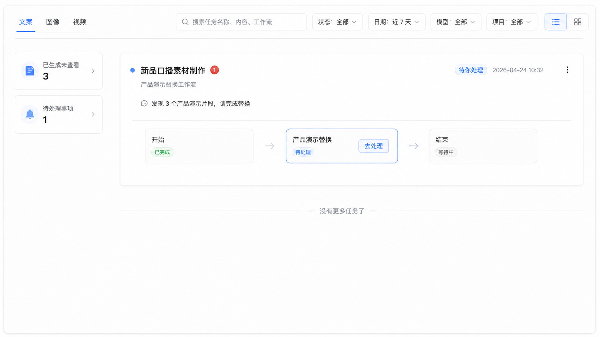

## 需求一：产品演示替换（自动卡断+AI 方案）

### 1.1 需求概述（先看这里）

**先说结论：** 这次交付的是一条完整工作流：原视频先自动找出产品演示片段，再替换用户选中的片段，最后按原位置还原成完整视频。

**人工处理怎么做：** 当产品演示片段大于 1 个时，任务在“我的任务”显示待处理入口。卡面和处理页只展示“开始 → 产品演示替换 → 结束”；不展示画布中其他内部节点。用户先播放原片、从时间轴上定位片段；点开某个片段后预览该片段，再选择替换视频。无需做映射表或合成预览。

**替换视频从哪里来：** 用户可选任务开始时已上传的视频、在此页继续上传的视频，或从系统资源导入。每选好一个片段，可以继续点下一个片段；都选完后点击“确认并继续任务”，系统按原片段位置和时长处理，并进入下一步。

### 1.2 本期交付产物（Input / Action / Output）

| 交付物 | Input | Action | Output | 运行详情（静态展示示例） |
| --- | --- | --- | --- | --- |
| 产品演示替换工作流 | 一整个原视频；任务开始时上传或处理中新增的替换视频。 | 依次执行产品演示内容卡断、片段数判断、必要时人工选择、内容替换和视频还原。 | 一条已完成产品演示替换的完整视频。 | 输入：原视频 1 个 输出：结果视频 1 个 |
| 产品演示内容卡断节点 | 一整个原视频。 | 识别产品演示内容并卡断为片段；为每个命中片段写入“产品演示”标签、原视频中的位置和顺序号。多个片段必须能区分第 1 个、第 2 个…… | 带产品演示标签、位置信息和顺序号的片段列表。 | 输入：原视频 1 个 输出：产品演示片段 3 个、其他片段 4 个 |
| 产品演示内容替换节点 | 产品演示内容卡断节点输出的产品演示片段；用户选择的替换视频。 | 判断片段数量：大于 1 个时进入人工配置页；用户定位并预览原片段后，为要替换的片段选择视频。替换后的片段继承原位置信息。 | 已替换的视频片段；每个片段仍带原视频中的位置信息。 | 输入：产品演示片段 3 个、替换视频 1 个 输出：已替换片段 1 个 |
| 视频还原节点 | 已替换的视频片段；原视频卡断出的其他未替换片段。 | 根据片段位置信息，将已替换片段和其余原片段按原顺序合成回去。 | 替换后的完整视频。 | 输入：已替换片段 3 个、其他原视频片段 2 个 输出：完整视频 1 个 |
| 基础配置：开始节点上传项 | 工作流中视频、图片上传项的字段配置。 | 支持为每个视频/图片上传项配置最大上传数量；使用页表单显示允许上传的数量上限和相应提示，并按配置校验。 | 可配置、可提示、可校验上传数量的开始节点表单。 | 表单：显示已上传数量和允许上传数量 |

### 1.3 用户路径与任务状态

| 阶段 | 用户看到什么 | 用户能做什么 | 系统结果 |
| --- | --- | --- | --- |
| 任务开始 | 原视频上传区、替换视频上传区；每个上传项展示数量限制和提示。 | 上传原视频和替换视频；可一次上传多个替换视频。 | 上传结果随任务保存，供后续节点使用。 |
| 产品演示替换 | 片段数量由系统在当前操作内判断。 | 0 个片段时无需操作；1 个片段时直接处理；大于 1 个片段时从“我的任务”进入人工配置页。 | 只在大于 1 个片段时暂停，等待用户完成替换选择。 |
| 人工配置页 | 原视频播放器、标注产品演示位置的时间轴。 | 点击片段标记，播放该片段；点“替换此片段”后选择视频来源。 | 用户确认自己要替换的位置，不需要填写映射表。 |
| 选择替换视频 | 已上传视频、上传视频、系统资源导入三个入口。 | 选择一个视频；已上传视频可删除、重新上传，也允许再次上传相同视频。 | 系统记录本次选择，并在时间轴轻量标记；用户可继续选择其他片段。 |
| 结束 | 人工审核式固定操作栏。 | 点击“确认并继续任务”。 | 当前操作完成，进入结束。 |

### 1.4 人工配置页（仅在产品演示片段数大于 1 时出现）

#### A. 我的任务：通用通知与任务卡入口

1. 新增或复用一个**通用待处理事项**通知容器，不以“产品演示替换”作为容器名称。通知项至少展示：处理类型、任务名称/摘要、待处理状态、创建时间和“去处理”按钮。
2. 任务卡沿用现有标题、任务 ID、流程节点和底部操作结构；流程只展示：开始（已完成）→ 产品演示替换（当前，主按钮“去处理”）→ 结束（等待中）。不展示画布里其他节点，也不假设节点的先后关系。
3. 通知项与任务卡主按钮跳到同一个处理页；用户无需回到工作流编辑器。
4. 已确认继续任务后，通知项消失，任务卡进入结束态。

#### B. 中间处理页：复用框架，填充产品演示内容

页面复用人工审核页的中间过程框架，只保留任务上下文、开始→产品演示替换→结束、原片工作区和底部确认操作；不新增产品演示专属后台，也不展示画布内部节点。

1. 工作区先播放原视频，在时间轴标记每个产品演示片段的起止位置和顺序号。
2. 用户点击时间轴上的片段标记，即定位并播放该片段。
3. 这一页只帮助用户确认“原片的哪一段”；不展示替换映射表、候选视频管理表或合成预览。

#### C. 片段预览与替换视频选择

1. 用户在 B 页点开片段后，播放该片段，并显示“替换此片段”入口。
2. 点击入口后，提供三种来源：任务开始时已上传的视频、在本页上传视频、从系统资源导入。
3. 提示文案固定为：“替换视频会合成到原片段位置，时长按原片段时长处理。”
4. 不把这里做成资源管理器：已上传视频允许删除；删除后允许再上传；已经上传过一个视频，也允许再上传相同视频。
5. 每选好一个片段，只在时间轴上轻量标记为“已选择”；用户可继续点开并替换其他片段，不展示映射表或合成结果预览。全部选择完成后点击“确认并继续任务”，进入结束。

---

## 需求二：合成/混剪-必选项仅保留片头

### 2.1 需求概述（先看这里）

**先说结论：** 卡片标题已经把核心规则讲清楚——合成/混剪中只有“片头”必填，其他片段都改为可选。

**用户怎么用：** 有片头就能提交；中段、结尾、产品演示等素材有就参与组合，没有就跳过对应组合，不把任务判成输入错误。运行详情说明系统实际用了哪些素材、生成了哪些组合。

### 2.2 页面与功能

| 页面 | 功能 | 建议方案 |
| --- | --- | --- |
| 工作流使用页 | 片段输入 | 片头标记为必填；其余片段输入均不显示必填标记。`已确认：来自卡片标题` |
| 工作流使用页 | 提交校验 | 片头缺失时阻止提交；可选片段缺失时不应被当成系统错误。`建议` |
| 合成/混剪节点 | 组合计算 | 只使用用户实际提供的片段生成合法组合；某条组合规则缺少素材时跳过该组合，不阻断其他合法组合。`建议` |
| 运行详情 | 结果说明 | 展示收到的片段、形成的组合和未参与组合的原因。`建议` |

---

## 需求三：混剪/合成工作流，支持 2 段视频的混编规则

### 3.1 需求概述（先看这里）

**先说结论：** 最近已有两种混剪规则连续无法满足实际情况，所以不能再为每个 case 单独补一条写死规则。推荐把“两段视频怎么拼”做成维护人员可配置的模板；普通用户只管上传素材，系统按已发布规则执行。

**用户怎么用：** 维护人员在编辑器里给位置 A、位置 B 绑定已有素材槽位，并确定 A → B 的顺序。运行时若两个位置各有多条素材，系统按 A × B 形成候选组合、去掉重复组合，再按既有输出上限产出；普通用户无需看到算法参数。

### 3.2 页面与功能

| 页面 | 功能 | 建议方案 |
| --- | --- | --- |
| 工作流使用页 | 准备素材 | 展示 A、B 两个位置所需的素材类型；沿用已发布工作流配置，不让普通用户临时改规则。 |
| 工作流编辑器 | 配置规则 | 为位置 A、B 绑定现有输入槽位，确定 A → B 的顺序。`建议` |
| 混剪/合成节点 | 生成组合 | 多素材时按 A × B 形成组合；同一成片内不重复使用同一片段；去重后按既有输出上限截取。`建议` |
| 运行详情 | 解释结果 | 展示 A/B 实际输入、候选组合数、去重/截取数量和最终输出。`建议` |

---

## 需求四：支持素材系统一键调用 AI 通用生成与工作流功能

### 4.1 需求概述（先看这里）

**先说结论：** 用户在素材系统看到合适素材后，不应该先下载、再到 AI 创作重新上传；点“用 AI 创作”就把素材带到通用生成或指定工作流的对应上传位置。

**用户怎么用：** 用户选择通用生成或某个工作流，系统打开对应 AI 创作页面并自动带入素材；校验通过后，用户补齐页面上其他必填项再提交，之后继续走正常的“我的任务”链路。系统不会因为一次跳转就自动创建任务。

### 4.2 页面与功能

| 页面/系统 | 功能 | 结果 |
| --- | --- | --- |
| 素材系统 | 提供“用 AI 创作”入口 | 用户选择通用生成或指定工作流。 |
| 素材系统 → AI 创作 | 传递生成类型、工作流和槽位 | AI 创作页打开后自动带入素材，并定位到指定槽位。 |
| AI 创作侧 | 校验素材 | 自行判断 URL 可读性、文件大小、视频时长和画质要求。 |
| AI 创作任务链路 | 记录使用情况 | 按素材 MD5 分别记录通用生成、工作流的使用次数。 |

### 4.3 需传递的信息

1. 通用生成类型枚举，例如图片、视频。
2. 支持跳转的工作流名称或稳定标识。
3. 每个工作流固定的素材传入槽位 ID。
4. 可直接读取的素材 URL，以及定位原素材所需的稳定标识。
5. AI 创作侧基于实际读取文件计算或校验 MD5，用于记录通用生成和工作流的使用次数。

> 上述是产品侧信息清单，不是已经定稿的接口字段。字段名、类型、必填性、鉴权和错误码由接口评审确定；调用方传入的 MD5 不能替代 AI 创作侧对实际文件的校验。

### 4.4 异常处理（产品建议）

1. URL 失效、文件过大、视频过长或格式不符合要求时，不创建空任务，直接展示具体原因。
2. 工作流不存在、已下线或槽位失效时，不进入可提交状态。
3. 素材 URL 过期、无读取权限或不属于当前租户可访问范围时，拒绝加载并说明原因，不跨租户读取素材。
4. 校验通过只代表素材已成功带入，不代表自动提交；用户补齐其他必填项并主动提交后，才创建任务。
5. 用户提交后能回到正常的我的任务链路。

---

## 需求五：视频字幕翻译

### 5.1 需求概述（先看这里）

**先说结论：** 用户需要把外网视频快速做成多语言版本；一个翻译任务要能给出三类结果：带翻译字幕的视频、可下载的翻译字幕、翻译后的音频。

**用户怎么用：** 上传视频、选择一个或多个目标语言，再选择需要的结果类型后提交；默认勾选三类结果，用户可以取消不需要的类型。任务完成后先按语言分组，再按视频、字幕、音频展示和下载；某一类失败时保留其他已成功结果。

### 5.2 页面与功能（产品建议）

| 页面 | 功能 | 结果 |
| --- | --- | --- |
| 工作流使用页 | 上传视频 | 展示视频文件、时长和识别状态。 |
| 工作流使用页 | 选择目标语言 | 原语言自动识别；可多选目标语言，并在提交前展示预计产物数量。首期推荐简体中文和英语。 |
| 工作流使用页 | 选择输出 | 字幕贴回视频、下载字幕、翻译音频默认全选，至少保留一种。 |
| 工作流节点 | 识别与翻译 | 识别原字幕或语音，翻译后保留时间轴。 |
| 我的任务 | 查看进度 | 先按目标语言分组，再分开展示视频、字幕、音频产物状态。 |
| 全部结果 | 下载结果 | 按语言和产物类型分别下载。 |

### 5.3 异常处理（产品建议）

1. 无法识别音频或字幕时，明确提示“无法识别”，不只显示“翻译失败”。
2. 某一种产物失败时，保留其他已成功产物，并展示分项状态。
3. 字幕时间轴异常时，在运行详情定位到具体片段。
