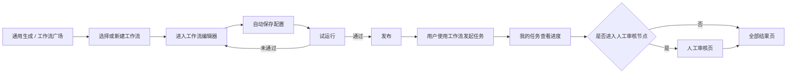
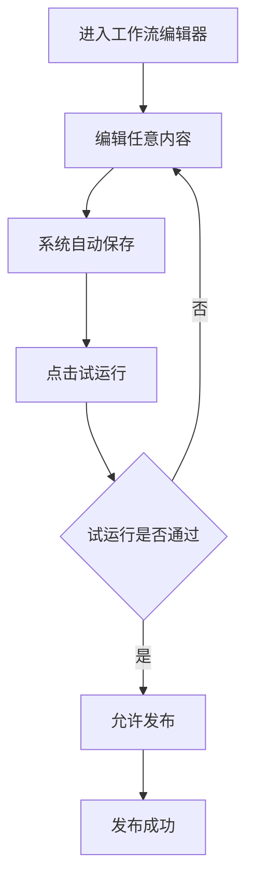
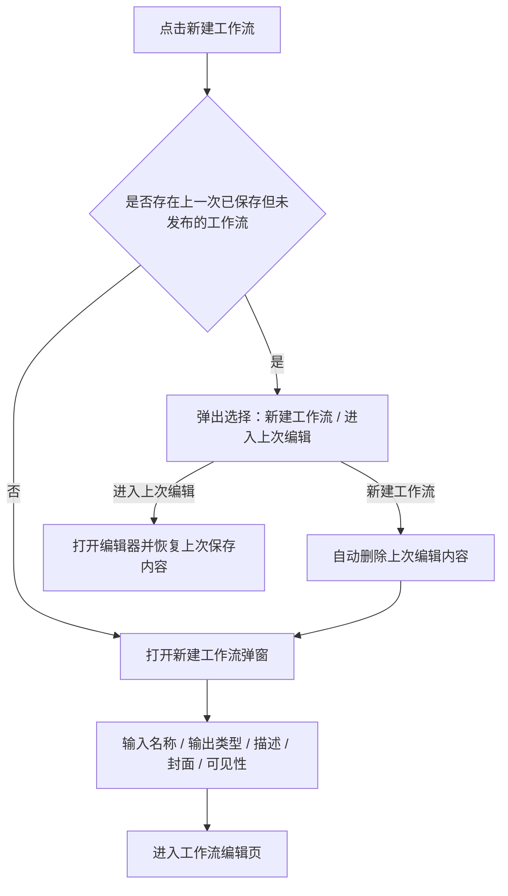

# 工作流详细需求说明文档（专业重构版）

> 本文档用于沉淀 AI 创作模块中「工作流」能力的统一需求口径，面向产品、设计、研发、测试和后续 AI Coding 执行使用。
>
> **SSOT 原则**：本文档是工作流功能的唯一事实来源。后续不再创建 `_v2`、`_final`、`最新版` 等副本文档。工作流相关需求变化必须直接更新本文档。
>
> **当前版本口径**：本文档已吸收 2026 年 4 月 30 日工作流细节打磨会议结论（260430 工作流确认）。若早期文档中存在“通用生成页展示去广场入口”“广场页包含我的创建”“节点支持手动上传参考图”“任务卡片展示开始审核”等旧口径，以本文档为准。

---

## 一、系统总览

### 1.1 页面地图

工作流系统归属于「AI 创作」模块，由固定菜单页和动作进入页共同组成：

```text
AI 创作（固定菜单）
├── 通用生成                  ← 单点创作入口 + 我的收藏/我的创建工作流
│   ├── 新建工作流弹窗
│   └── 工作流编辑器
├── 我的任务                  ← 图像 / 视频 / 文案任务融合展示
│   ├── 工作流运行态卡片
│   ├── 审查台
│   └── 全部结果页
├── 工作流广场
├── 工作流编辑器
└── 项目管理
```

### 1.2 用户主流程



### 1.3 页面职责总表

| 页面 | 文件 | 入口 | 核心职责 |
|---|---|---|---|
| 通用生成 | `AI 创作/通用生成.html` | 左侧导航「通用生成」；首页快捷入口 | 承接单点创作，并展示可直接使用的工作流 |
| 工作流广场 | `AI 创作/工作流广场.html` | 左侧导航「工作流广场」 | 展示部门范围内公开工作流，支持筛选、收藏、创建副本 |
| 工作流编辑器 | `AI 创作/工作流编辑器.html` | 从新建工作流、编辑工作流进入 | 拖拽配置工作流节点、参数、连线与发布 |
| 我的任务 | `AI 创作/我的任务.html` | 左侧导航「我的任务」 | 展示通用生成与工作流任务的运行态、待审核态与结果入口 |
| 全部结果页 | `AI 创作/全部结果-统一版.html` | 我的任务卡片进入 | 展示工作流/文案等任务的完整结果 |
| 人工审核页 | 独立审核页面 | 我的任务中的「点击审核」 | 审核人工审核节点产生的待审核内容 |

---

## 二、全局规则

### 2.1 工作流归属与展示范围

| 规则项 | 规则 |
|---|---|
| 工作流类型 | 工作流按文案、图像、视频三类管理与展示 |
| 可见性 | 新建工作流时可选择「仅自己可见」「团队公开」 |
| 团队公开范围 | 若选择「团队公开」，则该用户所属该层级的部门所有人可见，该用户所属该层级的负责人也可见 |
| 正式可用条件 | 只有发布后的工作流才可以正式使用，并进入工作流广场与通用生成展示区域 |
| 示例工作流 | 每个用户在「我的创建」中默认存在一个工作流，名称为「示例」 |

### 2.2 工作流卡片通用能力

| 能力 | 规则 |
|---|---|
| 卡片基础信息 | 工作流卡片由工作流标题、描述、封面图、最近编辑时间组成 |
| 收藏 | 用户可一键收藏，也可一键取消收藏 |
| 使用 | 用户可以直接使用工作流 |
| 编辑 | 用户可编辑自己创建的工作流 |
| 删除 | 删除工作流时必须弹出二次确认弹窗 |
| 副本 | 他人工作流支持创建副本；创建后生成一份完全一致的工作流，名称后自动追加“ - 副本” |

### 2.3 自动保存、试运行与发布规则



| 规则项 | 规则 |
|---|---|
| 自动保存触发项 | 拖拽连线、修改配置、新增节点、删除节点、修改任务名称、修改任务描述、修改任务权限等任意操作后，都会自动保存 |
| 试运行前置 | 用户进入编辑器后，只要对节点配置、连线、节点本身、任务名称、任务配置信息、权限等进行了任意修改，就必须点击试运行 |
| 发布前置 | 只有试运行通过之后，才可以发布工作流 |
| 发布后可见性 | 只有发布之后，工作流才进入工作流广场和通用生成展示区域 |

### 2.4 任务状态统一口径

| 任务类型 | 结束状态口径 | 说明 |
|---|---|---|
| 通用生成 | 已终止 / 已完成 / 已失败 | 原“已成功”统一调整为“已完成”，逻辑不变 |
| 工作流 | 已终止 / 已完成 | 不再根据内部是否存在失败、是否全部失败或部分失败定义结束状态；只要流程已经无法继续运行，或流程已进入结束节点，即统一认为任务“已完成” |

### 2.5 文案与审核统一口径

| 场景 | 规则 |
|---|---|
| 待审核状态文案 | 原“开始审核”或“审查中”统一调整为「待人工审核 (N个)」 |
| 待审核动作按钮 | 中间流程节点的操作按钮文案统一为「点击审核」 |
| 文案卡片展示 | 文案结果按条展示；长文案默认折叠，按页面规则支持查看全部 |
| 文案下载 | 文案任务下载统一为 CSV；命名规则与其他压缩包下载命名规则一致 |

---

## 三、页面规格

### 3.1 通用生成页

**文件**：`AI 创作/通用生成.html`  
**入口**：左侧导航「通用生成」；首页快捷入口  
**职责**：承接单点创作，并展示「我的收藏」「我的创建」工作流。

#### 3.1.1 页面结构

| 区域 | 说明 |
|---|---|
| 工作流展示区域 | 在通用生成页面增加工作流展示区域 |
| 顶部 Tab | 按文案、图像、视频切换工作流类型 |
| 我的收藏 | 展示用户收藏的工作流；若无数据，则不展示该标题 |
| 我的创建 | 展示用户创建的工作流；若无数据，则不展示该标题 |
| 新建工作流 | 提供创建新工作流入口 |

#### 3.1.2 工作流展示与卡片操作

- 工作流展示区域除标题和「新建工作流」外，分为「我的收藏」与「我的创建」。
- 初始状态下，每个用户在「我的创建」里都会有一个名称为「示例」的工作流。
- 用户可对该工作流执行编辑、收藏、删除、使用。
- 删除时必须弹出二次确认弹窗。

#### 3.1.3 通用生成（文案）配置规则

| 配置项 | 规则 |
|---|---|
| 生成能力 | 提供文案生成选项 |
| 模型 | 支持多选；提供模型列表 |
| 数量 | 用户选择生成数量后，按该数量请求模型；例如选择 10 条，则请求 10 次模型 |
| 项目 | 提供项目选择 |
| 提示词 | 提供提示词工具箱 |
| 参考文件 | 提供参考图 / 参考文件能力，但是否展示取决于当前所选模型支持的类型 |

**模型列表当前包含：**

| 模型展示名 | 模型真实名 |
|---|---|
| Gemini 3.1 Pro Preview | `gemini-31-pro` |
| Gemini 3 Flash Preview | `gemini-3-flash` |
| DeepSeek V4 Pro | `deepseek-v4-pro` |
| DeepSeek V4 Flash | `deepseek-v4-flash` |
| 豆包 2.0 | `doubao-20` |
| GPT 5.4 | `gpt-54` |
| Claude Sonnet 4.6 | `claude-sonnet-46` |

#### 3.1.4 参考文件与模型能力约束

| 场景 | 规则 |
|---|---|
| 单模型选择 | 上传能力按当前模型支持的文件类型决定 |
| 多模型同时选择 | 可上传的参考文件类型取多个模型共同支持能力中的最小集合 |
| 已上传参考文件后改选模型 | 不允许再选择不支持该文件类型的模型 |
| 不支持时的前端表现 | 不显示该类型的添加入口 |
| 示例 | 已在选中 Gemini 的情况下上传视频后，不支持再选中 DeepSeek |

#### 3.1.5 发起任务反馈

- 用户在通用生成中发起任务后，提示 toast：**任务已开始，您可在我的任务页中查看任务进度。**
- 发起任务后，不自动跳转到我的任务页。

#### 3.1.6 新建工作流流程



| 配置项 | 规则 |
|---|---|
| 名称 | 用户输入工作流名称；限制 200 字以内 |
| 输出类型 | 文案、图片、视频 |
| 描述 | 需要输入描述 |
| 封面 | 根据工作流名称自动生成；也允许用户手动上传 |
| 可见性 | 仅自己可见、团队公开 |

### 3.2 工作流广场页

**文件**：`AI 创作/工作流广场.html`  
**入口**：左侧导航「工作流广场」  
**职责**：展示部门范围内的公开工作流，支持筛选、搜索、收藏与创建副本。

#### 3.2.1 页面结构

- 按文案、图像、视频聚合展示工作流。
- 提供简单筛选能力。
- 展示当前用户所在部门范围内全部公开的工作流卡片。

#### 3.2.2 筛选与排序

| 维度 | 规则 |
|---|---|
| 搜索 | 支持模糊搜索工作流名称、说明、创建者 |
| 创建者筛选 | 单选下拉；展示当前用户同部门的人及其领导；支持模糊搜索 |
| 日期筛选 | 支持根据最近编辑日期进行筛选 |
| 排序 | 支持按使用次数升序 / 降序、收藏数量升序 / 降序、最近编辑时间升序 / 降序 |

#### 3.2.3 工作流卡片与操作

| 场景 | 规则 |
|---|---|
| 卡片信息 | 创建人名字展示在最近编辑时间前；同时展示收藏数量和使用次数 |
| 自己创建的工作流 | 可以看到，也可以正常操作 |
| 别人的工作流 | 仅支持收藏或创建副本 |
| 创建副本 | 复制一份与原工作流完全一致的工作流，并在名称后增加“ - 副本” |

### 3.3 工作流编辑器页

**文件**：`AI 创作/工作流编辑器.html`  
**职责**：通过拖拽式画布配置工作流。

#### 3.3.1 画布结构与基础交互

| 区域 | 规则 |
|---|---|
| 左上角 | 展示工作流任务名称 |
| 左侧 | 节点列表 |
| 中间 | 无限画布 |
| 右侧 | 节点配置菜单 |
| 右上角 | 展示自动保存时间状态、试运行、发布功能 |

| 交互项 | 规则 |
|---|---|
| 默认节点 | 新建工作流进入后，画布上默认展示开始节点和结束节点 |
| 节点删除 | 开始节点和结束节点在任何状态下都默认存在，且无法删除 |
| 节点拖入 | 用户可从左侧节点列表中拖拽节点进入画布 |
| 连线 | 用户可通过拖拽连线进行连接；线条顺序为从左到右 |
| 输入输出方向 | 每个节点左边默认是输入，右边连出去的线默认是输出 |
| 自动编号命名 | 向画布拖入节点时，若同名节点已存在，系统自动增加后缀，如 `文本处理-1`、`文本处理-2` |

#### 3.3.2 引用逻辑与通用限制

| 项目 | 规则 |
|---|---|
| 开始节点 | 支持定义手动上传项（图片 / 视频 / 文本等） |
| 中间节点 | 禁止手动上传参考内容；所有参考内容必须通过下拉框选择“之前节点输出的文件” |
| 图片 / 视频节点能力裁剪 | 不支持思考模式与自动去水印等非相关能力 |
| 比例 / 分辨率提示 | 在比例 / 分辨率配置旁增加 Tooltip：**若作为后续节点的参考图，建议选择较高分辨率** |

#### 3.3.3 参数面板统一交互规范

| 模块 | 规则 |
|---|---|
| 模型与提示词组件 | 文本生成、图像生成、视频生成三大核心节点共用一套底层交互组件，包括带标签检索的模型选择器、支持“变量胶囊”拖拽混排的富文本编辑器 |
| 参考文件操作 | 明确区分“本地直接上传”与“引用上游文件变量”两个触点；点击上传文字唤起本地系统文件窗口，点击选择区域唤起工作流内置级联菜单 |
| 变量级联选择 | 所有引用上游节点数据的操作，均采用统一级联菜单：首级选择来源节点，次级统一只显示“输出结果”；当上游节点无可用输出时，菜单项文字置灰且不可点 |
| 流式提示词编辑 | 提示词输入框支持纯文本与变量胶囊混排；变量为蓝色胶囊，带来源标识，左侧提供拖拽手柄 |

#### 3.3.4 数量与组合生成规则

| 场景 | 规则 |
|---|---|
| 单一文本输入 | 允许自由设定生成数量，默认上限 100 |
| 单结果输出 | 若节点只输出 1 个结果，则后端按单值类型处理，如字符串、图片或视频；该类型不在页面展示，仅作为后端定义 |
| 多结果输出 | 若节点输出多个结果，本质上是请求了多次模型，结果为数组类型 |
| 数组变量参与 | 若提示词内插入数组类型变量，或引用了数组类型参考文件资源，则节点按所有数组变量进行组合生成 |
| 组合生成限额 | 用户可选择低于组合总量的生成数量；达到用户设定数量后停止生成 |
| 上限收紧 | 当出现数组变量或前置参考资源参与组合生成时，系统判定为组合生成任务，并将最大限制动态收紧至 50，避免生成爆炸 |
| 结果传递时机 | 每个节点都必须在自身结果全部生成完成后，才会将结果一次性传递给下一个节点 |

#### 3.3.5 图像与视频专属配置

| 节点类型 | 配置项 | 规则 |
|---|---|---|
| 图片生成 | 比例 / 分辨率 | 选择固定比例（如 16:9）时，附加「清晰度」选择（1k / 2k / 4k）；选择自定义时，提供宽高双输入框 |
| 图片生成 | 自定义校验 | 用户输入宽高像素时，系统实时校验；不合法时输入框进入错误状态并展示错误提示；当前值不可继续试运行或发布；修改为合法值后错误自动消失 |
| 视频生成 | 思考模式 | 不支持思考模式 |
| 视频生成 | 参考模式 | 支持「智能参考」与「首尾帧」两种模式；选择首尾帧后，分离出独立的首帧与尾帧参考对象选择 |
| 视频生成 | 比例 | 不支持自定义，仅可通过下拉选择（如 16:9） |
| 视频生成 | 时长 | 仅支持下拉列表选择（如 5 秒、10 秒等） |

#### 3.3.6 节点列表与节点定义

当前左侧节点列表仅包含 4 个节点：**文本生成、图片生成、视频生成、人工审核**。

| 节点 | 是否在左侧列表展示 | 输入输出 | 主要职责 / 配置 |
|---|---|---|---|
| 开始节点 | 否 | 无输入，只有输出 | 默认存在于画布；用于定义工作流运行时的初始输入参数；支持配置多个输入项，由用户在使用工作流时填写 |
| 结束节点 | 否 | 只有输入，无输出 | 默认存在于画布；用于声明最终输出结果；需要配置输出类型（文案 / 图片 / 视频之一），并从之前节点输出中选择一个作为最终结果 |
| 文本生成节点 | 是 | 有输入有输出 | 用于生成创意文案、脚本或描述文本；配置包括名称、模型、是否开启思考模式、提示词、参考文件、生成数量 |
| 图片生成节点 | 是 | 有输入有输出 | 用于生成图片结果；配置包括名称、模型、提示词、参考文件、比例 / 分辨率、生成数量 |
| 视频生成节点 | 是 | 有输入有输出 | 用于生成视频结果；配置包括名称、模型、提示词、参考模式、参考文件、比例、时长、生成数量 |
| 人工审核节点 | 是 | 有输入有输出 | 用于暂停流程，等待人工审核通过或拒绝产物后再继续；当前主要配置为节点名称 |

#### 3.3.7 基础节点与抽象原则

| 项目 | 规则 |
|---|---|
| 基础节点命名 | 开始节点与结束节点不支持修改节点名称 |
| 结束节点产物配置 | 必须明确声明最终输出类型；输出内容同样复用标准级联选择菜单交互，不再使用传统原生下拉框 |
| 单一职责 | 复杂业务逻辑应拆分为多个原子节点 |
| 行业封装 | 未来将复杂的行业能力（如李强算法引擎）封装为行业专用 Processor |

### 3.4 我的任务页

**文件**：`AI 创作/我的任务.html`

#### 3.4.1 页面导航与状态提示

| 项目 | 规则 |
|---|---|
| 新增 Tab | 在我的任务页新增文案 Tab |
| 新增导航 | 在原有“进行中任务”和“任务已生成未查看任务”之外，新增“待审核任务” |
| 待审核任务出现条件 | 若存在待人工审核状态的任务，则展示“待审核任务”导航 |
| 导航行为 | 用户点击“待审核任务”后，自动定位到对应任务区域 |
| 侧边栏状态 | 侧边栏菜单中也需要展示该状态及对应数量 |

#### 3.4.2 工作流任务卡片

| 场景 | 规则 |
|---|---|
| 普通状态卡片信息 | 仅展示工作流标签、工作流任务名称、生成结果、开始时间、状态 |
| 卡片底部按钮 | 与原通用生成任务卡片一致 |
| 失败态按钮 | 若工作流出现生成失败，则出现「查看详情」按钮 |
| 失败详情展示 | 点击后弹出弹窗；弹窗内容按节点聚合错误真实原因 |
| 失败原因口径 | 当前会失败的节点主要是生成节点，因此失败原因口径与图像、视频通用生成一致 |
| 全部失败表现 | 卡片上只展示“全部失败”，不展示全部具体原因；具体原因在「查看详情」中查看 |

#### 3.4.3 待人工审核态卡片

| 场景 | 规则 |
|---|---|
| 卡片样式 | 当工作流卡片进入待人工审核节点时，切换为原型中的待人工审核状态卡片样式 |
| 节点展示 | 展示开始节点、结束节点，以及中间当前触发的待人工审核节点 |
| 审核入口 | 用户可点击「点击审核」，直接进入审核页面 |
| 多节点待审核 | 若同时存在大于 1 个待人工审核节点，则增加第 3 个节点，第 3 个节点仅展示剩余审核节点数量 |
| 多节点审核顺序 | 若同时触发多个待人工审核节点，则第 2 个节点仍展示当前按顺序需先审核的节点；用户点击审核后，仍按顺序一个一个审核 |

#### 3.4.4 文案任务卡片

| 项目 | 规则 |
|---|---|
| 基础逻辑 | 文案任务类型、任务卡片类型、状态、按钮交互与图像、视频任务一致 |
| 结果展示 | 卡片中仅展示前 4 条生成的文案 |
| 数量不足 4 条 | 若只生成 1、2、3 条，则展示对应数量 |
| 操作入口 | 在文案区域右下角展示文案数量和「查看全部」按钮 |

### 3.5 全部结果页

**文件**：`AI 创作/全部结果-统一版.html`

#### 3.5.1 工作流结果展示

| 项目 | 规则 |
|---|---|
| 基础信息 | 当任务类型为工作流时，只展示已生成多少条、一共要生成多少条、状态、工作流名称、任务名称 |
| 名称展示 | 工作流名称与任务名称的展示形式为：`XXX工作流-XXXX任务` |
| 其他按钮 | 保持一致 |
| 文案展示控制 | 当全部结果类型为文案时，不展示大中小按钮 |

#### 3.5.2 文案下载

| 项目 | 规则 |
|---|---|
| 下载格式 | 点击下载时，全部下载内容为 CSV 表 |
| 文件命名 | 与下载其他压缩包文件的命名规则一致 |
| 列结构 | 仅两列：序号、文案 |
| 数据范围 | 表内只展示已经生成好的内容 |

### 3.6 人工审核页

#### 3.6.1 入口与页面结构

| 项目 | 规则 |
|---|---|
| 进入方式 | 用户点击我的任务中的「点击审核」后进入人工审核页 |
| 页头信息 | 页面最上方展示该工作流任务名称 |
| 节点切换 | 任务名称下方，以按钮形式展示该任务中的人工审核节点 |
| 默认节点 | 默认进入用户刚才点击「点击审核」所进入的那个已到达可审核状态的节点 |
| 状态筛选 | 在节点区域下方提供「全部」「可审核」「已通过」「已拒绝」几个状态 |
| 默认状态 | 默认进入「可审核」 |

#### 3.6.2 节点点击规则

| 场景 | 规则 |
|---|---|
| 触发待审核条件 | 只有当某一待审核节点的全部结果都已经生成完成，且该节点所需的 Input 部分已经全部进入之后，才会触发“待审核” |
| 按钮可点击条件 | 节点待审核内容已经生成完成 |
| 不可点击表现 | 若待审核内容仍在生成中，则按钮置灰且不允许点击 |
| 提示文案 | 鼠标放上去时，提示：**待审核内容还未就绪** |

#### 3.6.3 审核操作规则

| 场景 | 规则 |
|---|---|
| 图片 / 视频审核 | 用户可以在下方区域查看待审核内容 |
| 文案审核展示 | 文案展示形式与全部结果页中的文案展示形式一致；内容按一条一条展示 |
| 长文案折叠 | 文案过长时默认只展示两行；点击「查看全部」展开；点击「收起」后收起 |
| 单项审核操作 | 每个内容下方都有一个勾和一个叉；点勾表示通过，点叉表示未通过 |
| 生效时机 | 点击后即刻生效 |
| 撤回 | 用户无论操作为已通过还是已拒绝，之后都不能撤回 |
| 批量操作 | 页面右上角有「全部通过」「全部拒绝」按钮；操作范围是当前已经生成好的内容 |

#### 3.6.4 预览规则

| 场景 | 规则 |
|---|---|
| 图片 / 视频预览 | 可点开查看大图或播放 |
| 预览内审核操作 | 打开大图或播放后，底下也要有明显的勾和叉 |
| 翻页能力 | 同时提供「上一张」「下一张」按钮 |

---

## 四、附录：规则汇总

### 4.1 可直接用于评审与开发对齐的重点规则

1. 工作流只在**发布后**进入通用生成与工作流广场。
2. 任何编辑器修改都会触发**自动保存**，但**发布前必须重新试运行**。
3. 中间节点**禁止手动上传参考内容**，只能引用上游输出。
4. 数组变量或数组型参考资源参与时，系统进入**组合生成模式**，数量上限动态收紧至 **50**。
5. 工作流任务的结束状态统一为**已终止 / 已完成**，不再根据内部失败比例拆分。
6. 待人工审核统一口径为**待人工审核 (N个)**，操作入口统一为**点击审核**。
7. 文案在卡片、结果页、审核页三处都按“**逐条展示**”思路处理；下载统一为 **CSV**。

### 4.2 建议在原型或研发实现中重点保真的交互

| 交互 | 需要重点保真 |
|---|---|
| 新建工作流时恢复上次未发布内容 | 是 |
| 工作流编辑器自动保存状态反馈 | 是 |
| 变量胶囊拖拽混排与级联选择 | 是 |
| 自定义分辨率实时校验与错误阻断 | 是 |
| 待人工审核多节点排队展示 | 是 |
| 预览态内直接审核 | 是 |

---

**最后更新**：2026-05-05
