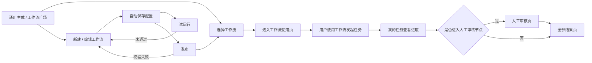
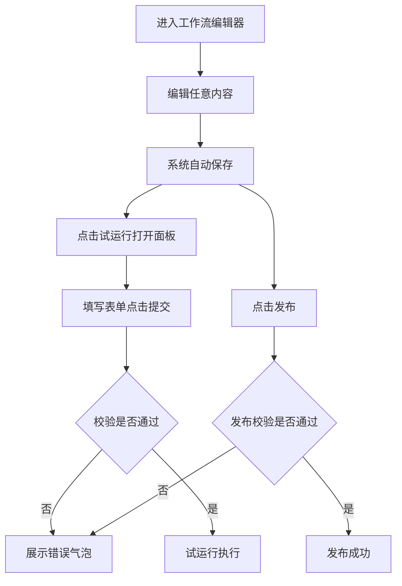
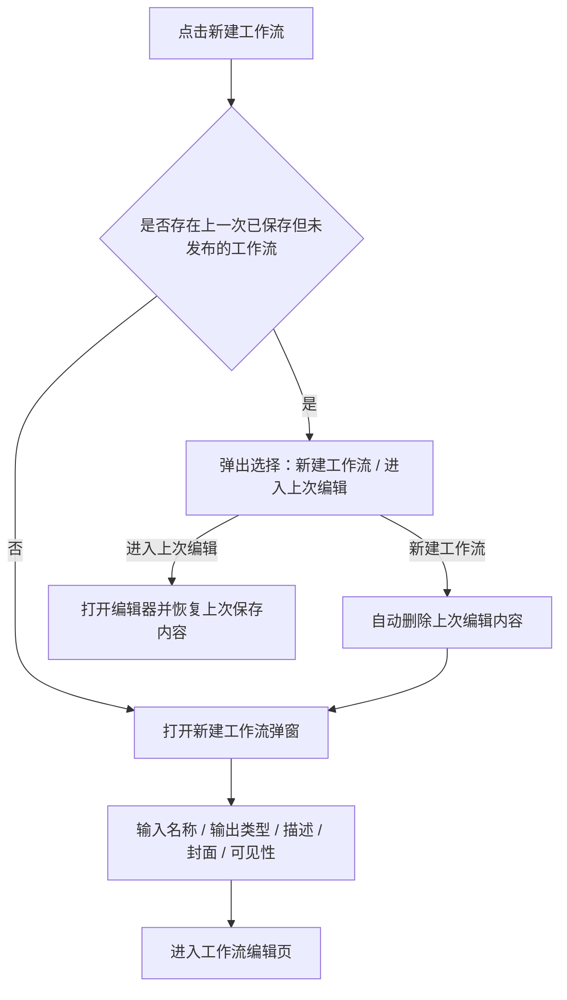

# AI创作系统需求文档（V1.2）

# AI创作系统需求文档（V1.2）

## 一、系统总览

### 1.1 页面地图

工作流系统归属于「AI 创作」模块，由固定菜单页和动作进入页共同组成：

```text
AI 创作（固定菜单）
├── 通用生成                  ← 单点创作入口 + 我的收藏/我的创建工作流
│   ├── 新建工作流弹窗
│   └── 工作流使用页
├── 我的任务                  ← 图像 / 视频 / 文案任务融合展示
│   ├── 工作流运行态卡片
│   ├── 人工审核页
│   └── 全部结果页
├── 工作流广场
│   └── 工作流使用页
└── 项目管理


```

### 1.2 用户主流程



### 1.3 页面职责总表

| 页面 | 文件 | 入口 | 核心职责 |
| --- | --- | --- | --- |
| 通用生成 | `AI 创作/通用生成.html` | 左侧导航「通用生成」；首页快捷入口 | 承接单点创作，并展示可直接使用的工作流 |
| 工作流广场 | `AI 创作/工作流广场.html` | 左侧导航「工作流广场」 | 展示部门范围内公开工作流，支持筛选、收藏、创建副本 |
| 工作流使用页 | 独立使用页面 | 通用生成或工作流广场的工作流卡片 | 用户填写工作流运行所需表单并提交任务 |
| 工作流编辑器 | `AI 创作/工作流编辑器.html` | 从新建工作流、编辑工作流进入 | 拖拽配置工作流节点、参数、连线与发布 |
| 我的任务 | `AI 创作/我的任务.html` | 左侧导航「我的任务」 | 展示通用生成与工作流任务的运行态、待审核态与结果入口 |
| 全部结果页 | `AI 创作/全部结果-统一版.html` | 我的任务卡片进入 | 展示工作流/文案等任务的完整结果 |
| 人工审核页 | 独立审核页面 | 我的任务中的「点击审核」 | 审核人工审核节点产生的待审核内容 |

---

## 二、全局规则

### 2.1 工作流归属与展示范围

| 规则项 | 规则 |
| --- | --- |
| 工作流类型 | 工作流按文案、图像、视频三类管理与展示 |
| 可见性 | 工作流权限分为「私有」和「部门内公开」 |
| 部门内公开范围 | 若选择「部门内公开」，则该用户所属该层级的部门的所有人可见，该用户所属该层级的负责人也可见 |
| 所有权转移 | 若工作流拥有者离开组织，其拥有的工作流自动转给对应负责人 |
| 正式可用条件 | 只有发布后的工作流才可以正式使用，并进入工作流广场与通用生成展示区域 |

### 2.2 工作流卡片通用能力

| 能力 | 规则 |
| --- | --- |
| 卡片基础信息 | 工作流卡片由工作流标题、描述、封面图、创建人、最近编辑时间组成 |
| 收藏 | 用户可一键收藏，也可一键取消收藏 |
| 使用 | 用户可以直接使用工作流 |
| 编辑 | 用户可编辑自己创建的工作流 |
| 删除 | 删除工作流时必须弹出二次确认弹窗 |
| 副本 | 自己创建或者他人的工作流支持创建副本；创建后生成一份完全一致的工作流，名称后自动追加“副本” |

### 2.3 自动保存、试运行与发布规则



| 规则项 | 规则 |
| --- | --- |
| 自动保存触发项 | 拖拽连线、修改配置、新增节点、删除节点、修改任务名称、修改任务描述、修改任务权限等任意操作后，都**会自动保存** |
| 试运行表单与校验 | 点击试运行弹出表单面板，用户填写完毕点击「提交」时触发校验。校验项目包括：<br>1. **连线完整性**：开始节点和结束节点之间必须有连接路径。<br>2. **结束节点完整性**：必须已选择“输出类型”和“输出内容”。<br>3. **生成节点完整性**：所有的文本生成节点、图片生成节点、视频生成节点都必须填写有“提示词”。<br>4. **大模型调用次数限制**：所有节点预计调用大模型次数合计不得超过 500 次；若超过，提示：**当前工作流调用大模型次数过多，请将调用次数降低到500次以内**。<br>5. **后向引用限制**：若发现某节点的输入依赖后续节点的输出，则提示：**XX节点的输入引用了XX节点的输出，暂不支持该引用方式。**<br>若校验失败，弹出悬浮错误气泡展示具体原因。若校验通过，任务开始执行，并提示“任务已开始，您可在我的任务页中查看任务进度。” |
| 试运行与发布关系 | 试运行和发布为两个独立功能；用户不需要先试运行通过，也可以在任意时刻点击发布 |
| 发布校验 | 用户点击发布后立即开始校验，校验逻辑与试运行一致；若校验失败，则提示失败原因 |
| 发布失败影响 | 发布校验失败时，不更新通用生成和工作流广场中的工作流卡片 |
| 发布后可见性 | 发布校验通过并发布成功后，工作流进入工作流广场和通用生成展示区域 |
| 草稿展示 | 用户任何时候进入工作流编辑器，都只展示该工作流的最新草稿 |
| 任务快照 | 我的任务中的任务，按提交任务时的工作流状态执行，不受后续草稿编辑影响 |

### 2.4 任务状态统一口径

| 任务类型 | 状态 | 说明 |
| --- | --- | --- |
| 通用生成 | 排队中 / 生成中/ 已中止 / 已完成 / 已失败 | 原“已成功”统一调整为“已完成”，逻辑不变 |
| 工作流 | 生成中/ 已中止 / 已完成 | 不再根据内部是否存在失败、是否全部失败或部分失败定义结束状态；只要流程已经无法继续运行，或流程已进入结束节点，即**统一认为任务“已完成”** |

### 2.5 文案与审核

| 场景 | 规则 |
| --- | --- |
| 待审核状态文案 | 原“开始审核”或“审查中”统一调整为「待人工审核 (N个)」 |
| 待审核动作按钮 | 中间流程节点的操作按钮文案统一为「点击审核」 |
| 文案卡片展示 | 文案结果按条展示；长文案默认折叠，按页面规则支持查看全部 |

---

## 三、页面说明

### 3.1 通用生成页

**文件**：`AI 创作/通用生成.html`**入口**：左侧导航「通用生成」；首页快捷入口   **职责**：承接单点创作，并展示「我的收藏」「我的创建」工作流。

#### 3.1.1 页面结构

| 区域 | 说明 |
| --- | --- |
| 工作流展示区域 | 在通用生成页面增加工作流展示区域 |
| 顶部 Tab | 按文案、图像、视频切换工作流类型 |
| 我的收藏 | 展示用户收藏的工作流；若无数据，则不展示该标题 |
| 我的创建 | 展示用户创建的工作流；若无数据，则不展示该标题 |
| 新建工作流 | 提供创建新工作流入口 |

#### 3.1.3 通用生成-文案配置规则

| **配置项** | **规则** |
| --- | --- |
| 生成能力 | 提供文案生成选项 |
| 模型 | 支持多选；提供模型列表 |
| 数量 | 用户选择生成数量后，按该数量请求模型；例如选择 10 条，则请求 10 次模型 |
| 项目 | 提供项目选择 |
| 提示词 | 提供提示词工具箱 |
| 参考文件 | 提供参考图 / 参考文件能力，但是否展示取决于当前所选模型支持的类型 |

**模型列表当前包含：**

| **模型展示名** | **模型真实名** | **多模态能力** |
| --- | --- | --- |
| Gemini 3.1 Pro Preview | `gemini-3.1-pro-prview` | 视频/图片/音频 |
| Gemini 3 Flash Preview | `gemini-3-flash-prview` | 视频/图片/音频 |
| DeepSeek V4 Pro | `deepseek-v4-pro` |  |
| DeepSeek V4 Flash | `deepseek-v4-flash` |  |
| 豆包 2.0 | `doubao-seed-2.0` | 图片 |
| GPT 5.4 | `gpt-5.4` | 图片 |
| Claude Sonnet 4.6 | `claude-sonnet-4.6` | 图片 |

#### 3.1.4 参考文件与模型能力约束

| 场景 | 规则 |
| --- | --- |
| 单模型选择 | 上传能力按当前模型支持的文件类型决定 |
| 多模型同时选择 | 可上传的参考文件类型取多个模型共同支持能力中的最小集合 |
| 已上传参考文件后改选模型 | 不允许再选择不支持该文件类型的模型 |
| 不支持时的前端表现 | 不显示该类型的添加入口 |
| 参考文件排序 | 用户上传多个参考文件时，按上传顺序从左到右排列展示；该顺序作为任务数据的一部分保存 |
| 顺序保持 | 参考文件顺序在我的任务、全部结果页、重新编辑任务时保持固定，不允许因页面刷新、重新打开或异步加载而改变 |
| 示例 | 已在选中 Gemini 的情况下上传视频后，不支持再选中 DeepSeek |

#### 3.1.5 发起任务反馈

用户在通用生成/工作流中发起任务后，提示 toast：**任务已开始，您可在我的任务页中查看任务进度。**

发起任务后，不自动跳转到我的任务页，留在当前页面，且当前页面输入的内容清空。

如果是第一次发起任务，开始开始后则弹窗提醒连接钉钉获取通知。


#### 3.1.6 工作流展示

工作流展示区域按顶部 Tab 区分文案、图像、视频三类工作流。区域内除标题和「新建工作流」按钮外，按「我的收藏」和「我的创建」分组展示。

| 内容 | 规则 |
| --- | --- |
| 我的收藏 | 展示用户收藏的工作流；为空时不展示该标题。 |
| 我的创建 | 展示用户创建的工作流；为空时不展示该标题。 |
| 示例工作流 | 每个用户初始在「我的创建」中拥有一个名为「示例」的工作流。<br>该工作流由开始、图像生成、结束节点组成，开始节点需要用户输入：参考图、提示词。输出为图片。 |
| 卡片信息 | 展示标题、描述、封面图、最近编辑时间。 |
| 卡片操作 | 收藏、取消收藏、删除、创建副本、进入工作流编辑页、使用。点击工作流卡片或点击「使用」进入工作流使用页。卡片原型如图【卡片原型】，如果页面上和这个图不一致，以这个图为准。<br>其中点击"详"，就是进入工作流编辑页。 |


卡片原型

#### 3.1.7 新建工作流流程



| 配置项 | 规则 |
| --- | --- |
| 名称 | 用户输入工作流名称；限制 200 字以内 |
| 输出类型 | 文案、图片、视频 |
| 描述 | 需要输入描述 |
| 封面 | 根据工作流名称自动生成；也允许用户手动上传 |
| 可见性 | 私有、部门内公开 |

### 3.2 工作流广场页

**文件**：`AI 创作/工作流广场.html`**入口**：左侧导航「工作流广场」   **职责**：展示部门范围内的公开工作流，支持筛选、搜索、收藏与创建副本。

#### 3.2.1 页面结构

*   按文案、图像、视频聚合展示工作流。
    
*   提供简单筛选能力。
    
*   展示当前用户所在部门范围内全部公开的工作流卡片。
    

#### 3.2.2 筛选与排序

| 维度 | 规则 |
| --- | --- |
| 搜索 | 支持模糊搜索工作流名称、说明、创建者 |
| 创建者筛选 | 单选下拉；展示当前用户同部门的人及其领导；支持模糊搜索 |
| 日期筛选 | 支持根据最近编辑日期进行筛选 |
| 排序 | 支持按使用次数升序 / 降序、收藏数量升序 / 降序、最近编辑时间升序 / 降序 |

#### 3.2.3 工作流卡片与操作

| 场景 | 规则 |
| --- | --- |
| 卡片信息 | 创建人名字展示在最近编辑时间前；同时展示收藏数量和使用次数 |
| 自己创建的工作流 | 可以看到，也可以正常操作 |
| 别人的工作流 | 仅支持收藏或创建副本 |
| 使用工作流 | 点击工作流卡片或点击「使用」进入工作流使用页 |
| 创建副本 | 复制一份与原工作流完全一致的工作流，并在名称后增加“-副本” |
| 查看详情 | 通过点击右上角的"详"按钮，可以查看他人工作流的详情，但是内容不可编辑。页面如图【他人工作流详情页】，这个页面原型不好展示，看图吧 |


【他人工作流详情页】

### 3.3 工作流使用页

**文件**：独立使用页面   **入口**：点击通用生成或工作流广场中的工作流卡片   **职责**：承载用户使用工作流前必须填写的运行表单，并提交生成任务。

#### 3.3.1 页面结构

| 区域 | 规则 |
| --- | --- |
| 页面名称 | 页面名称展示为当前工作流名称 |
| 表单用途 | 该页面为用户使用工作流必须填写的表单页 |
| 固定表单项 | 表单固定开头为「任务名称」 |
| 动态表单项 | 「任务名称」之后的表单内容由该工作流开始节点设置决定；开始节点配置了哪些输入项，使用页就展示哪些填写项 |

#### 3.3.2 任务名称规则

| 项目 | 规则 |
| --- | --- |
| 预填规则 | 进入页面时，任务名称按「工作流名称-mm/dd-hh/mm」规则自动预填 |
| 长度限制 | 任务名称最多 50 个字 |
| 超长处理 | 若按规则生成的任务名称超过 50 个字，则自动截断到 50 个字以内 |

#### 3.3.3 提交规则

| 项目 | 规则 |
| --- | --- |
| 提交动作 | 用户填写表单后点击提交，系统按当前工作流配置发起任务 |
| 提交反馈 | 提交成功后，toast 提示：**任务已开始，您可在我的任务页中查看任务进度。** |
| 提交后页面状态 | 提交成功后不跳转页面，清空表单内容 |
| 任务名称更新 | 表单清空后，重新按「工作流名称-mm/dd-hh/mm」规则更新任务名称 |

### 3.4 工作流编辑器页

**文件**：`AI 创作/工作流编辑器.html`**职责**：通过拖拽式画布配置工作流。

#### 3.4.1 画布结构与基础交互

| **区域** | **规则** |
| --- | --- |
| 左上角 | 展示工作流任务名称 |
| 左侧 | 节点列表 |
| 中间 | 无限画布 |
| 右侧 | 节点配置菜单 |
| 右上角 | 展示自动保存时间状态、试运行、发布功能 |

| **交互项** | **规则** |
| --- | --- |
| 默认节点 | 新建工作流进入后，画布上默认展示开始节点和结束节点 |
| 节点删除 | 开始节点和结束节点在任何状态下都默认存在，且无法删除 |
| 节点拖入 | 用户可从左侧节点列表中拖拽节点进入画布 |
| 节点数量上限 | 一个工作流内最多允许存在 50 个节点；当已达到 50 个节点后，用户再拖入新节点时不创建节点，并提示：**已到达节点最大数量限制** |
| 连线 | 用户可通过拖拽连线进行连接；线条顺序为从左到右 |
| 输入输出方向 | 每个节点左边默认是输入，右边连出去的线默认是输出 |
| 节点名称唯一 | 同一个工作流内不允许存在重名节点 |
| 自动编号命名 | 向画布拖入节点时，若同名节点已存在，系统自动增加后缀，如 `文本处理_1`、`文本处理_2` |

#### 3.4.2 引用逻辑与通用限制

| 项目 | 规则 |
| --- | --- |
| 开始节点 | 支持定义手动上传项（图片 / 视频 / 文本等） |
| 中间节点 | 禁止手动上传参考内容；所有参考内容必须通过下拉框选择“之前节点输出的文件” |
| 图片 / 视频节点能力裁剪 | 不支持思考模式与自动去水印等非相关能力 |
| 比例 / 分辨率提示 | 在比例 / 分辨率标题旁增加 "?",鼠标hover上去后显示：**若作为后续节点的参考图，建议选择较高分辨率** |

#### 3.4.3 参数面板统一交互规范

| 模块 | 规则 |
| --- | --- |
| 模型与提示词组件 | 文本生成、图像生成、视频生成三大核心节点共用一套底层交互组件，包括带标签检索的模型选择器、支持“变量胶囊”拖拽混排的富文本编辑器 |
| 参考文件操作 | 点击选择区域唤起工作流内置级联菜单 |
| 参考文件选择入口 | 文本生成、图片生成、视频生成节点中，若已经添加参考文件，则不再显示“点击选择……”入口；用户删除已添加参考文件后，该入口重新显示 |
| 变量级联选择 | 所有引用上游节点数据的操作，均采用统一级联菜单：首级选择来源节点，次级统一只显示“输出结果”；当上游节点无可用输出或者输出类型不符时，菜单项文字置灰且不可点 |
| 流式提示词编辑 | 提示词输入框支持纯文本与变量胶囊混排；变量为蓝色胶囊，带来源标识，左侧提供拖拽手柄 |
| 提示词必填 | 文本生成、图片生成、视频生成节点的提示词均为必填项 |
| 提示词变量 | 文本生成、图片生成、视频生成节点的提示词中可以引用多个变量 |
| 参考文件变量 | 文本生成、图片生成、视频生成节点的参考文件为选填项；若选择参考文件变量，最多只能添加 1 个变量 |

#### 3.4.4 数量与组合生成规则

| 场景 | 规则 |
| --- | --- |
| 循环生成控制 | 在文本生成节点提供「循环生成」开关（默认开启，原“多次生成”）；开启时按生成数量多次请求大模型，关闭时仅请求一次大模型。<br>若关闭该选项，生成数量上限强制为 10，系统会在提示词中加入要求 JSON 格式输出多条数据的指令，并在运行后自动解析拆分成多个独立结果。若解析失败则节点运行失败，报错：数组解析失败。 |
| 单一文本输入 | 允许自由设定生成数量，默认上限 100 |
| 单结果输出 | 若节点只输出 1 个结果，则后端按单值类型处理，如字符串、图片或视频； |
| 多结果输出 | 若节点输出多个结果，本质上是请求了多次模型，输出结果为数组类型 |
| 数组变量参与 | 若提示词内插入数组类型变量，或引用了数组类型参考文件资源，则系统判定为组合生成，上述的「循环生成」开关将**强制锁定开启并置灰**，同时数量上限收紧。 |
| 组合生成限额 | 用户可选择低于组合总量的生成数量；达到用户设定数量后停止生成 |
| 上限收紧 | 当出现数组变量或前置参考资源参与组合生成时，系统判定为组合生成任务，并将最大限制动态收紧至 50，避免生成爆炸 |
| 结果传递时机 | 每个节点都必须在自身结果全部生成完成后，才会将结果一次性传递给下一个节点 |

#### 3.4.5 图像与视频专属配置

| 节点类型 | 配置项 | 规则 |
| --- | --- | --- |
| 图片生成 | 比例 / 分辨率 | 选择固定比例（如 16:9）时，附加「清晰度」选择（1k / 2k / 4k）；选择自定义时，提供宽高双输入框 |
| 图片生成 | 自定义校验 | 用户输入宽高像素时，系统实时校验；不合法时输入框进入错误状态并展示错误提示；当前值不可继续试运行或发布；修改为合法值后错误自动消失 |
| 视频生成 | 参考模式 | 支持「智能参考」与「首尾帧」两种模式；选择首尾帧后，分离出独立的首帧与尾帧参考对象选择 |
| 视频生成 | 比例 | 不支持自定义，仅可通过下拉选择（如 16:9） |
| 视频生成 | 时长 | 仅支持下拉列表选择（如 5 秒、10 秒等） |

#### 3.4.6 节点列表与节点定义

当前左侧节点列表仅包含 4 个节点：**文本生成、图片生成、视频生成、人工审核**。

| 节点 | 是否在左侧列表展示 | 输入输出 | 主要职责 / 配置 |
| --- | --- | --- | --- |
| 开始节点 | 否 | 工作流固定开头 | 默认存在于画布；用于定义工作流运行时的初始输入参数；支持配置多个输入项，由用户在使用工作流时填写 |
| 结束节点 | 否 | 工作流固定结尾 | 默认存在于画布；用于声明最终输出结果；需要配置输出类型（文案 / 图片 / 视频之一），并从之前节点输出中选择一个作为最终结果 |
| 文本生成节点 | 是 | 有输入有输出 | 用于生成创意文案、脚本或描述文本；配置包括名称、模型、是否开启思考模式、提示词、参考文件、生成数量 |
| 图片生成节点 | 是 | 有输入有输出 | 用于生成图片结果；配置包括名称、模型、提示词、参考文件、比例 / 分辨率、生成数量 |
| 视频生成节点 | 是 | 有输入有输出 | 用于生成视频结果；配置包括名称、模型、提示词、参考模式、参考文件、比例、时长、生成数量 |
| 人工审核节点 | 是 | 有输入有输出 | 用于暂停流程，等待人工审核通过或拒绝产物后再继续；当前主要配置为节点名称，**人工全部将待审核内容审核通过后，才流转到下一个节点。** |

#### 3.4.7 基础节点与抽象原则

| 项目 | 规则 |
| --- | --- |
| 基础节点命名 | 开始节点与结束节点不支持修改节点名称 |
| 节点重命名校验 | 用户手动修改节点名称时，若与当前工作流内其他节点重名，则不允许保存，并提示节点名称不可重复 |
| 结束节点产物配置 | 必须明确声明最终输出类型；输出内容同样复用标准级联选择菜单交互，不再使用传统原生下拉框 |
| 单一职责 | 复杂业务逻辑应拆分为多个原子节点 |

#### 3.4.8 其他零碎需求

1.  开始节点和结束节点一开始就存在于画布上，并且不可以删除。
    
2.  画布可以无限拖拽，节点之间可以并行连接，线段可以选中删除可以用户可以按住端已经连连上线的端点，并且将其连接到其他的节点。
    
3.  除了开始节点和结束节点，其他节点没有固定先后顺序，可以任意组合。
    
4.  图像节点未来将会接入去水印功能，本版本没有该功能。
    
5.  用户可以点击左上角编辑，比如名称、描述、权限等。这个表单的内容编辑后，不需要试运行即可立即生效。
    
6.  试运行，如果失败，按失败的节点聚合失败原因。比如说如果是图像生成失败，视频也生成失败，那么是，那么侧边栏需要显示节点的名称，并且在下面显示失败的原因，如图。
    
    
    
7.  工作流自动保存当前状态，用户ctrl+z可以撤回操作。
    
8.  按住ctrl+滚轮，可以缩小放大画布。
    

### 3.5 我的任务页

**文件**：`AI 创作/我的任务.html`

#### 3.5.1 页面导航与状态提示

| 项目 | 规则 |
| --- | --- |
| 新增 Tab | 在我的任务页新增文案 Tab |
| 新增导航 | 在原有“进行中任务”和“任务已生成未查看任务”之外，新增“待审核任务” |
| 待人工审核状态出现条件 | 当有待审待人工审核节点被触发的时候，该任务变为待人工审核的状态 |
| 导航行为 | 用户点击“待审核”组件后，自动定位到对应任务区域。 |
| 侧边栏菜单展示 | 侧边栏菜单中也需要展示该状态和数量。 |
| 钉钉通知 | 如果触发待人工审核状态，钉钉自动通知：您的【工作流名称】-【任务名称】任务进入待人工审核状态了，点击开始审核。 |

#### 3.5.2 筛选规则

| 筛选项 | 规则 |
| --- | --- |
| 状态筛选 | 状态筛选新增「待人工审核」；其他状态与通用生成任务共用同一套状态口径 |
| 模型筛选 | 模型筛选仅作用于通用生成任务，不包含工作流任务 |
| 项目筛选 | 项目筛选仅作用于通用生成任务，不包含工作流任务 |
| 日期范围筛选 | 日期范围筛选同时作用于通用生成任务和工作流任务 |

#### 3.5.3 工作流任务卡片

| 场景 | 规则 |
| --- | --- |
| 普通状态卡片信息 | 仅展示工作流标签、工作流任务名称、生成结果、开始时间、状态 |
| 卡片底部按钮 | 与原通用生成任务卡片一致 |
| 全部任务入口 | 只要任务已开始生产出大于等于 1 个结果，任务卡片即展示「全部任务」按钮；用户点击后进入全部结果页 |
| 失败态按钮 | 若工作流出现生成失败，则出现「查看详情」按钮 |
| 失败详情展示 | 点击后弹出弹窗；弹窗内容按节点聚合错误真实原因 |
| 失败原因口径 | 当前会失败的节点主要是生成节点，因此失败原因口径与图像、视频通用生成一致 |
| 全部失败表现 | 卡片上只展示“全部失败”，不展示全部具体原因；具体原因在「查看详情」中查看 |
| 参考文件顺序 | 若任务展示参考文件，必须沿用用户发起任务时的上传顺序，从左到右固定展示 |

#### 3.5.4 任务操作规则

| 操作 | 规则 |
| --- | --- |
| 重新编辑入口 | 任务卡片支持「重新编辑」；点击后按任务来源跳转到对应页面 |
| 试运行任务重新编辑 | 若任务来源为工作流编辑器试运行，则进入对应工作流草稿，并回填本次试运行的表单内容 |
| 表单发起任务重新编辑 | 若任务来源为工作流使用页表单发起，则回到对应工作流使用页，并回填本次任务提交的表单内容 |
| 任务名称更新 | 重新编辑时，任务名称不沿用旧任务名称，必须按当前时间重新执行任务名称预填规则 |
| 内容回填 | 重新编辑时，除任务名称外，之前任务填写的内容必须回填到对应页面的对应表单项中 |
| 无权限/失效处理 | 用户点击「重新编辑」时，若对应工作流已失效、被删除或当前用户无权限访问，则不进入编辑页/使用页，并提示“找不到/为空” |
| 再次生成 | 工作流任务下的「再次生成」与原发起逻辑一致；按原任务来源和原表单内容再次发起任务 |

#### 3.5.5 查看详情规则

| 场景 | 规则 |
| --- | --- |
| 详情入口 | 工作流任务提供「查看详情工作流」入口 |
| 展示条件 | 仅当任务已完成且过程中出现错误时，才展示「查看详情」入口；全程无错则不展示 |
| 错误覆盖 | 某节点发生报错时，无论该错误是否阻塞整个工作流，都需要在详情中展示报错信息 |
| 错误聚合 | 详情中的节点报错按节点聚合展示，展示格式为节点名称 + 对应错误 |
| 数量解释 | 详情页用于解释“预估生成数量与最终结果数量不一致”的原因，包括节点失败、人工拒绝、组合生成截断等导致数量变化的情况 |

#### 3.5.6 待人工审核态卡片

| 场景 | 规则 |
| --- | --- |
| 卡片样式 | 当工作流卡片进入待人工审核节点时，切换为原型中的待人工审核状态卡片样式 |
| 节点展示 | 展示开始节点、结束节点，以及中间当前触发的待人工审核节点 |
| 审核入口 | 用户可点击「点击审核」，直接进入审核页面 |
| 多节点待审核 | 若同时存在大于 1 个待人工审核节点，则增加第 3 个节点，第 3 个节点仅展示剩余审核节点数量 |
| 多节点审核顺序 | 若同时触发多个待人工审核节点，则第 2 个节点仍展示当前按顺序需先审核的节点；用户点击审核后，仍按顺序一个一个审核 |

#### 3.5.7 文案任务卡片

| 项目 | 规则 |
| --- | --- |
| 基础逻辑 | 文案任务类型、任务卡片类型、状态、按钮交互与图像、视频任务一致 |
| 结果展示 | 卡片中仅展示前 4 条生成的文案 |
| 数量不足 4 条 | 若只生成 1、2、3 条，则展示对应数量 |
| 操作入口 | 在文案区域右下角展示文案数量和「查看全部」按钮 |

### 3.6 全部结果页

**文件**：`AI 创作/全部结果-统一版.html`

#### 3.6.1 工作流结果展示

| 项目 | 规则 |
| --- | --- |
| 基础信息 | 当任务类型为工作流时，只展示已生成多少条、一共要生成多少条、状态、工作流名称、任务名称，如图 |
| 名称展示 | 工作流名称与任务名称的展示形式为：`XXX工作流-XXXX任务` |
| 页面展示 | 全部结果页展示工作流名称、任务名称、已生成数量、完成状态等基础信息 |
| 展示范围 | 「查看全部」页只展示最终结果，不展示复杂中间配置，例如提示词、参考图、节点配置等 |
| 其他按钮 | 当全部结果为文案的时候：<br>下载全部改为：导出表格（以这个文案为准）<br>去除多选按钮 |
| 文案展示控制 | 当全部结果类型为文案时，不展示大中小按钮 |
| 参考文件顺序 | 若全部结果页展示参考文件或可重新编辑任务，参考文件必须沿用用户发起任务时的上传顺序；重新编辑时也按该顺序回填 |

基础信息


全部结果页中，选项文案样式：


#### 3.6.2 导出表格

| 项目 | 规则 |
| --- | --- |
| 下载格式 | 点击下载时，全部下载内容为 CSV 表 |
| 文件命名 | 与下载其他压缩包文件的命名规则一致 |
| 列结构 | 仅两列：序号、文案 |
| 数据范围 | 表内只展示已经生成好的内容 |

### 3.7 人工审核页

#### 3.7.1 入口与页面结构

| 项目 | 规则 |
| --- | --- |
| 进入方式 | 用户点击我的任务中的「点击审核」后进入人工审核页 |
| 页头信息 | 页面最上方分别展示工作流名称和任务名称；两者独立成行，不合并成「审核 - xxx」标题 |
| 审核点导航 | 任务名称下方展示该任务内全部人工审核点；审核点按工作流顺序水平居中排列，中间仅用水平线连接，不强化流程导航样式。审核点名称必须展示对应人工审核节点的真实节点名称，不使用“审核点A”“审核点B”等占位名称 |
| 默认节点 | 默认进入用户刚才点击「点击审核」所进入的那个已到达可审核状态的节点 |
| 内容节点切换 | 审核点导航下方展示当前审核点接收的上游内容节点；若一个审核点接收多个上游节点结果，则必须按内容来源节点分组切换。内容节点名称必须展示对应上游节点的真实节点名称，不使用“内容节点1”“内容节点2”等占位名称 |
| 状态筛选 | 内容节点切换下方提供「全部」「可审核」「已通过」「已拒绝」几个状态 |
| 默认状态 | 默认进入「可审核」 |
| 筛选作用域 | 状态筛选只作用于当前选中的审核点和当前选中的内容节点，不做跨审核点或跨内容节点的全局筛选 |

#### 3.7.2 审核点与内容节点层级

| 项目 | 规则 |
| --- | --- |
| 层级结构 | 人工审核页按「审核点 → 内容节点 → 状态筛选 → 内容列表」组织 |
| 审核点定义 | 审核点对应工作流中的人工审核节点；一个任务可包含多个审核点 |
| 审核点命名 | 审核点在页面上展示为对应人工审核节点的真实名称；例如人工审核节点名为“视频初审”时，审核页中也展示“视频初审” |
| 审核点展示 | 审核点按流程顺序水平排列并用连接线串联；节点文案上方展示审核点名称，下方展示正式状态标签，不使用 emoji 表达状态 |
| 审核点排序 | 多个审核点之间按其前置节点数量从少到多排列；例如前面只有 1 个节点的审核点，排在前面有 2 个节点的审核点之前。若前置节点数量一致，则可随机排列 |
| 审核点状态 | 审核点至少包含「已完成」「审核中」「准备中」三类状态 |
| 已完成状态 | 当前审核点下所有内容节点都处理完成并提交后，审核点整体展示为「已完成」状态并打勾；已完成节点可点击进入查看，但不能撤回或修改已生效审核结果 |
| 审核中状态 | 审核中节点展示进行态，默认可点击并可执行审核操作 |
| 准备中状态 | 准备中节点展示未开始态，置灰且不可点击 |
| 默认选中 | 从我的任务「点击审核」进入时，默认选中触发入口对应的审核点；若入口未指定，则默认选中第一个审核中的审核点 |
| 内容节点定义 | 内容节点对应流入当前审核点的上游节点结果；一个审核点可接收一个或多个内容节点 |
| 内容节点命名 | 内容节点在页面上展示为对应上游节点的真实名称；例如上游节点名为“视频初审素材生成”时，审核页中也展示“视频初审素材生成” |
| 内容节点分组 | 不同来源节点的结果必须分组展示，不允许把多个来源节点的内容混在同一个列表中审核 |
| 内容类型分组 | 文案、图片、视频等不同内容类型不混合展示；若同一审核点接收多种类型内容，应通过内容节点分组或类型分组分别展示 |
| 内容节点状态 | 内容节点需要展示自身审核进度；内容节点名称下方展示正式状态标签。已全部审核完成时展示完成状态，仍有可审核内容时展示待审核状态或待审核数量 |

#### 3.7.3 节点点击规则

| 场景 | 规则 |
| --- | --- |
| 触发待审核条件 | 只有当某一人工审核节点所需的全部上游内容节点结果都已经生成完成，且该审核节点所需的 Input 部分已经全部进入之后，才会触发“待审核” |
| 通知触发 | 同一个人工审核节点只在其所需内容全部到齐后触发一次待审核通知，避免多个上游节点陆续完成时重复通知 |
| 审核点可点击条件 | 审核点处于「已完成」或「审核中」状态 |
| 内容节点可点击条件 | 内容节点已有可查看或可审核内容 |
| 不可点击表现 | 若审核点或内容节点仍在准备中，则置灰且不允许点击 |
| 提示文案 | 鼠标放上去时，提示：**待审核内容还未就绪** |

#### 3.7.4 审核操作规则

| 场景 | 规则 |
| --- | --- |
| 图片 / 视频审核 | 用户可以在下方区域查看待审核内容 |
| 文案审核展示 | 文案内容按一条一条展示；每条文案使用轻卡片承载，避免把所有内容展示成连续输入框线条 |
| 审核粒度 | 审核页中的内容均按单条内容进行审核，不把多条内容合并成一个审核对象 |
| 文案高度 | 文案高度按内容自适应：一行文案只占一行高度；长文案最多展示 5 行高度，超出部分在文案区域内滚动 |
| 文案编辑 | 文案内容在提交前支持点击编辑；提交前无论该内容处于可审核、已通过或已拒绝状态，都允许继续编辑。提交后不可编辑 |
| 文案单项操作布局 | 文案类内容的「通过」「拒绝」按钮放在文案左侧，并与文案正文第一行在同一水平线上对齐 |
| 单项审核操作 | 可审核内容同时展示「通过」和「拒绝」操作；已通过内容只保留「拒绝」操作；已拒绝内容只保留「通过」操作。通过按钮使用系统主色蓝，拒绝按钮使用错误色 |
| 临时存储 | 用户逐条通过、拒绝或编辑文案后，审核结果先作为临时结果保存在当前页面，不立即提交到工作流 |
| 提交按钮 | 在「全部拒绝」按钮右侧增加「提交」按钮 |
| 提交作用域 | 「提交」按钮只提交当前选中的内容节点，不提交当前审核点下的其他内容节点 |
| 提交可用条件 | 当前内容节点下仍有待审核内容时，「提交」按钮不可点击；鼠标悬停在不可点击按钮上提示：**请先完成审核** |
| 提交前修改 | 在点击「提交」前，已审核内容仍可重新决定通过或拒绝；文案类内容仍可编辑 |
| 提交生效 | 用户点击「提交」后，当前内容节点的审核结果才真正提交；提交后不允许回退或修改已提交结果 |
| 提交后状态 | 内容节点提交后，该内容节点下的审核内容不可再进行任何操作，只能查看 |
| 待提交提示 | 当当前内容节点下可审核内容已经全部处理完成但尚未提交时，页面中间显示灰色提示文案：**请点击"提交"按钮，完成该内容节点审核，当该审核点所有内容节点审核完成后，通过审核的内容会流转到下一个节点**，并用绕圈圈的箭头指向「提交」按钮 |
| 批量操作 | 页面右上角有「全部通过」「全部拒绝」按钮；操作范围是当前审核点、当前内容节点下当前可审核内容 |
| 批量确认 | 用户点击「全部通过」或「全部拒绝」后，必须经过两次确认弹窗，确认后才将当前可审核内容批量标记为通过或拒绝 |
| 完成流转 | 当前审核点全部内容节点完成审核并提交后，系统将通过的内容整合打包发往工作流下一节点 |
| 完成反馈 | 审核完成后页面不自动跳转，停留在当前页，并通过 Toast 提示：**该节点已全部审核结束** |
| 已审核内容 | 已通过和已拒绝内容支持回看；已生效的审核结果不可再次修改 |
| 生产中内容 | 工作流生产过程中的内容，用户可在审核页查看，也可保存 |
| 下载能力 | 审核页增加下载按钮；文本类内容支持下载文件，文案类下载内容为 CSV 文件，字段为序号和文案 |

#### 3.7.5 预览规则

| 场景 | 规则 |
| --- | --- |
| 图片列表展示 | 图片内容在列表中按固定卡片尺寸从左到右、从上到下排列，不拉伸填满整行 |
| 图片 / 视频预览 | 可点击图片或视频打开大图/大预览 |
| 预览信息展示 | 大图状态下不展示提示词和参考文件，只展示媒体内容、底部操作按钮和左右切换按钮 |
| 预览内审核操作 | 大图状态下图片下方展示「通过」「拒绝」「下载」按钮；已通过内容只保留「拒绝」和「下载」，已拒绝内容只保留「通过」和「下载」 |
| 翻页能力 | 大图左右两侧提供上一张、下一张按钮；在大图模式下点击通过或拒绝后，自动切换到下一张可展示图片 |


---

## 四、附录：规则汇总

### 4.1 可直接用于评审与开发对齐的重点规则

1.  工作流只在**发布后**进入通用生成与工作流广场。
    
2.  任何编辑器修改都会触发**自动保存**；试运行和发布相互独立，发布时会执行与试运行一致的校验。
    
3.  中间节点**禁止手动上传参考内容**，只能引用上游输出。
    
4.  数组变量或数组型参考资源参与时，系统进入**组合生成模式**，数量上限动态收紧至 **50**。
    
5.  工作流任务的结束状态统一为**已终止 / 已完成**，不再根据内部失败比例拆分。
    
6.  待人工审核统一口径为**待人工审核 (N个)**，操作入口统一为**点击审核**。
    
7.  文案在卡片、结果页、审核页三处都按“**逐条展示**”思路处理；下载统一为 **CSV**。

8.  人工审核页按“**审核点 → 内容节点 → 状态筛选 → 内容列表**”组织；审核点和内容节点都需要在名称下方展示正式状态，内容必须按来源节点分组，文案审核支持编辑后再通过或拒绝。

9.  人工审核页的提交按钮仅在当前内容节点的待审核内容清空后可点击；待审核内容未处理完时禁用，并提示**请先完成审核**。

10.  图片审核支持小图网格和大图预览；大图状态下只展示图片、左右切换、通过、拒绝、下载，审核后自动切换下一张。

11.  用户点击通用生成或工作流广场的工作流卡片后进入**工作流使用页**；该页展示由工作流开始节点决定的运行表单，提交成功后留在当前页并清空表单。
