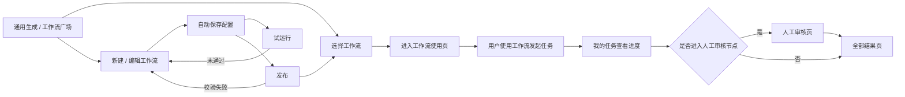
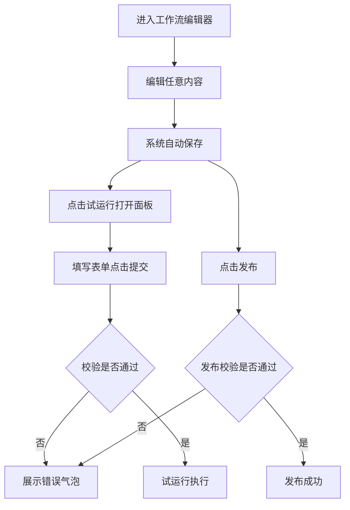
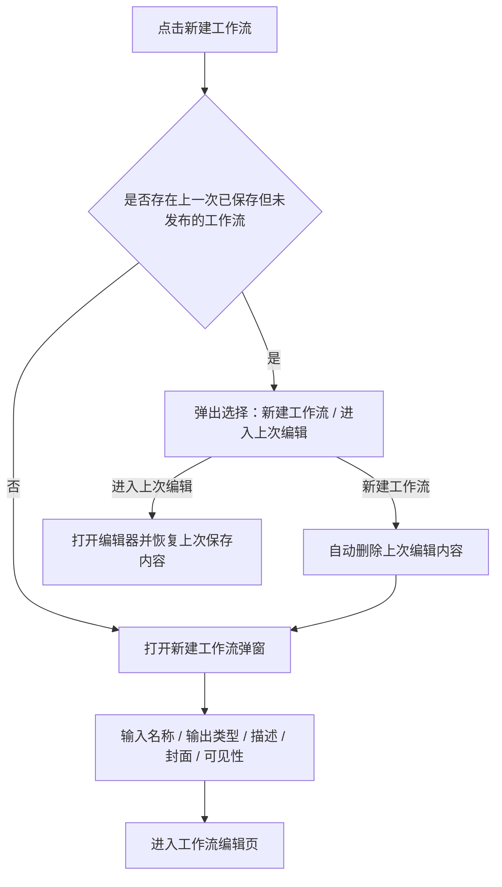

# AI创作系统需求文档（V1.2）

更新

| 新增 | 内容 |
| --- | --- |
| #### 工作流保存逻辑 | **新建工作流的保存逻辑：**  <br>用户在新建工作流过程中如果中途离开，系统会自动保存为“新建草稿”。当用户下次再次点击新建工作流时，系统检测到存在未完成草稿后，提示用户是否继续上次创建；如果用户选择继续，则恢复上次填写内容，如果选择放弃并新建，则删除该草稿并进入全新的创建流程。<br>**编辑工作流的保存逻辑：**  <br>对于已经创建好的工作流，用户进入编辑后未发布的修改不应直接覆盖当前正式版本，而是保存为“编辑草稿”或“未发布版本”。用户下次打开该工作流时，如果存在未发布修改，系统弹窗是否继续编辑；如果继续，则进入未发布版本，如果放弃，则只删除未发布的编辑内容，保留当前已发布版本不受影响。 |
| 新增文本模型使用限制说明 | [‬⁠⁠⁠‬‬⁠‬通用生成模型参考文件能力与限制表（CLI） - 飞书云文档](https://q3t5rgpff5.feishu.cn/docx/O89AdMID8o95oHxbODPckth1nXb)[‬⁠⁠⁠‬‬⁠‬通用生成模型参考文件能力与限制表（CLI） - 飞书云文档](https://q3t5rgpff5.feishu.cn/docx/O89AdMID8o95oHxbODPckth1nXb) |
| 新增ComfyUI类型节点 | 见文档末尾：五、六 |
| 删除原需求中"文本/图片/视频生成"节点 |
| 节点输出收敛为单输出 |
| 工作流编辑页节点展示与输入输出交互调整 | 节点库详见：3.4.7；画布节点状态详见：3.4.8；输入/输出项交互详见：3.4.10 |
| ComfyUI 节点编辑保存校验调整 | 详见：6.3 保存校验与另存为新节点 |
| 节点编辑页输入/输出类型选择调整 | 输入/输出总口径详见：5.1 ComfyUI 封装节点输入/输出说明；表单规则详见：6.2 输入/输出配置 |
| ComfyUI 节点下线/删除后的工作流提示规则 | 工作流试运行/发布校验详见：2.3.1；节点库隐藏和画布状态详见：3.4.9；已发布工作流使用拦截详见：3.3.4 |
| 工作流开始节点输入项规则调整 | 开始节点输入类型限定为文本、图片、视频、分辨率、数值；每个输入项增加是否必填；图片、视频类型增加最大上传数量配置。 |
| ComfyUI 节点输入项必填规则调整 | ComfyUI 节点管理页中每个输入项增加必填/非必填选项，默认必填；工作流发布前只校验必填输入项必须选中来源。 |

## 一、系统总览

### 1.1 页面地图

工作流系统归属于「AI 创作」模块，由固定菜单页和动作进入页共同组成：

```text
AI 创作（固定菜单）
├── 通用生成                  ← 单点创作入口 + 我的收藏/我的创建工作流
│   ├── 新建工作流弹窗
│   └── 工作流使用页
├── 我的任务                  ← 图像 / 视频 / 文案任务融合展示
│   ├── 工作流运行态卡片
│   ├── 人工审核页
│   └── 全部结果页
├── 工作流广场
│   └── 工作流使用页
└── 项目管理
```

### 1.2 用户主流程



### 1.3 页面职责总表

| 页面 | 文件 | 入口 | 核心职责 |
| --- | --- | --- | --- |
| 通用生成 | `AI 创作/通用生成.html` | 左侧导航「通用生成」；首页快捷入口 | 承接单点创作，并展示可直接使用的工作流 |
| 工作流广场 | `AI 创作/工作流广场.html` | 左侧导航「工作流广场」 | 展示部门范围内公开工作流，支持筛选、收藏、创建副本 |
| 工作流使用页 | 独立使用页面 | 通用生成或工作流广场的工作流卡片 | 用户填写工作流运行所需表单并提交任务 |
| 工作流编辑器 | `AI 创作/工作流编辑器.html` | 从新建工作流、编辑工作流进入 | 拖拽配置工作流节点、参数、连线与发布 |
| 我的任务 | `AI 创作/我的任务.html` | 左侧导航「我的任务」 | 展示通用生成与工作流任务的运行态、待审核态与结果入口 |
| 全部结果页 | `AI 创作/全部结果-统一版.html` | 我的任务卡片进入 | 展示工作流/文案等任务的完整结果 |
| 人工审核页 | 独立审核页面 | 我的任务中的「点击审核」 | 审核人工审核节点产生的待审核内容 |

---

## 二、全局规则

### 2.1 工作流归属与展示范围

| 规则项 | 规则 |
| --- | --- |
| 工作流类型 | 工作流按文案、图像、视频三类管理与展示 |
| 可见性 | 工作流权限分为「私有」和「部门内公开」 |
| 团队公开范围 | 若选择「部门内公开」，则该用户所属该层级的部门的所有人可见，该用户所属该层级的负责人也可见 |
| 所有权转移 | **若工作流拥有者离开组织，其拥有的工作流的拥有者自动转给该部门负责人，负责人如果离开组织，则自动转给"超级管理员"（到时候创建一个这个账号），接受每天或者每三天凌晨自动更新一次。更新之前可以正常使用。** |
| 正式可用条件 | 只有发布后的工作流才可以正式使用，并进入工作流广场与通用生成展示区域 |

### 2.2 工作流卡片通用能力

| 能力 | 规则 |
| --- | --- |
| 卡片基础信息 | 工作流卡片由工作流标题、描述、封面图、创建人、最近编辑时间组成 |
| 收藏 | 用户可一键收藏，也可一键取消收藏 |
| 使用 | 用户可以直接使用工作流 |
| 编辑 | 用户可编辑自己创建的工作流 |
| 删除 | 删除工作流时必须弹出二次确认弹窗 |
| 副本 | 自己创建或者他人的工作流支持创建副本；创建后生成一份完全一致的工作流，名称后自动追加“副本” |

### 2.3 自动保存、试运行与发布规则



| 规则项 | 规则 |
| --- | --- |
| 自动保存触发项 | 拖拽连线、修改配置、新增节点、删除节点、修改任务名称、修改任务描述、修改任务权限等任意操作后，都**会自动保存** |
| 试运行表单与校验 | 点击试运行弹出表单面板，用户填写完毕点击「提交」时触发统一校验；校验项详见下方“工作流试运行/发布统一校验项”。若校验失败，弹出悬浮错误气泡展示具体原因。若校验通过，任务开始执行，并提示“任务已开始，您可在我的任务页中查看任务进度。” |
| 试运行与发布关系 | 试运行和发布为两个独立功能；用户不需要先试运行通过，也可以在任意时刻点击发布 |
| 发布校验 | 用户点击发布后立即开始统一校验，校验逻辑与试运行一致；若校验失败，则提示失败原因 |
| 发布失败影响 | 发布校验失败时，不更新通用生成和工作流广场中的工作流卡片 |
| 发布后可见性 | 发布校验通过并发布成功后，工作流进入工作流广场和通用生成展示区域 |
| 草稿展示 | 用户任何时候进入工作流编辑器，都只展示该工作流的最新草稿 |
| 任务快照 | 我的任务中的任务，按提交任务时的工作流状态执行，不受后续草稿编辑影响 |

#### 2.3.1 工作流试运行/发布统一校验项

| 校验项 | 触发动作 | 校验规则 | 失败提示 |
| --- | --- | --- | --- |
| 连线完整性 | 试运行、发布 | 开始节点和结束节点之间必须存在有效连接路径 | 开始节点和结束节点之间必须有连接路径。 |
| 结束节点完整性 | 试运行、发布 | 结束节点必须已选择输出类型和输出内容 | 结束节点必须选择输出类型和输出内容。 |
| ComfyUI 节点输入完整性 | 试运行、发布 | 所有 ComfyUI 封装节点中标记为必填的输入项必须已选择有效来源；非必填输入项允许不选择来源 | XX节点存在未设置的必填输入项，请设置后再继续。 |
| 后向引用限制 | 试运行、发布 | 节点输入不能引用后续节点的输出 | XX节点的输入引用了XX节点的输出，暂不支持该引用方式。 |
| 失效节点校验 | 试运行 | 画布中不能存在已删除或已下线的 ComfyUI 节点 | 当前工作流存在已删除/已下线节点，请删除后再试运行。 |
| 失效节点校验 | 发布 | 画布中不能存在已删除或已下线的 ComfyUI 节点 | 当前工作流存在已删除/已下线节点，请删除后再发布。 |

### 2.4 任务状态统一口径

| 任务类型 | 状态 | 说明 |
| --- | --- | --- |
| 通用生成 | 排队中 / 生成中/ 已中止 / 已完成 / 已失败 | 原“已成功”统一调整为“已完成”，逻辑不变 |
| 工作流 | 生成中/ 已中止 / 已完成 | 不再根据内部是否存在失败、是否全部失败或部分失败定义结束状态；只要流程已经无法继续运行，或流程已进入结束节点，即**统一认为任务“已完成”** |

### 2.5 文案与审核

| 场景 | 规则 |
| --- | --- |
| 待审核状态文案 | 原“开始审核”或“审查中”统一调整为「待人工审核 (N个)」 |
| 待审核动作按钮 | 中间流程节点的操作按钮文案统一为「点击审核」 |
| 文案卡片展示 | 文案结果按条展示；长文案默认折叠，按页面规则支持查看全部 |

---

## 三、页面说明

### 3.1 通用生成页

**文件**：`AI 创作/通用生成.html`**入口**：左侧导航「通用生成」；首页快捷入口   **职责**：承接单点创作，并展示「我的收藏」「我的创建」工作流。

#### 3.1.1 页面结构

| 区域 | 说明 |
| --- | --- |
| 工作流展示区域 | 在通用生成页面增加工作流展示区域 |
| 顶部 Tab | 按文案、图像、视频切换工作流类型 |
| 我的收藏 | 展示用户收藏的工作流；若无数据，则不展示该标题 |
| 我的创建 | 展示用户创建的工作流；若无数据，则不展示该标题 |
| 新建工作流 | 提供创建新工作流入口 |

#### 3.1.3 通用生成-文案配置规则

| **配置项** | **规则** |
| --- | --- |
| 生成能力 | 提供文案生成选项 |
| 模型 | 支持多选；提供模型列表 |
| 数量 | 用户选择生成数量后，按该数量请求模型；例如选择 10 条，则请求 10 次模型 |
| 项目 | 提供项目选择 |
| 提示词 | 提供提示词工具箱 |
| 参考文件 | 提供参考图 / 参考文件能力，但是否展示取决于当前所选模型支持的类型 |

**模型列表当前包含：**

| **模型展示名** | **模型真实名** | **多模态能力** |
| --- | --- | --- |
| Gemini 3.1 Pro Preview | `gemini-3.1-pro-prview` | 视频/图片/音频 |
| Gemini 3 Flash Preview | `gemini-3-flash-prview` | 视频/图片/音频 |
| DeepSeek V4 Pro | `deepseek-v4-pro` |  |
| DeepSeek V4 Flash | `deepseek-v4-flash` |  |
| 豆包 2.0 | `doubao-seed-2.0` | 图片 |
| GPT 5.4 | `gpt-5.4` | 图片 |
| Claude Sonnet 4.6 | `claude-sonnet-4.6` | 图片 |

#### 3.1.4 参考文件与模型能力约束

| 场景 | 规则 |
| --- | --- |
| 单模型选择 | 上传能力按当前模型支持的文件类型决定 |
| 多模型同时选择 | 可上传的参考文件类型取多个模型共同支持能力中的最小集合 |
| 已上传参考文件后改选模型 | 不允许再选择不支持该文件类型的模型 |
| 不支持时的前端表现 | 不显示该类型的添加入口 |
| 参考文件排序 | 用户上传多个参考文件时，按上传顺序从左到右排列展示；该顺序作为任务数据的一部分保存 |
| 顺序保持 | 参考文件顺序在我的任务、全部结果页、重新编辑任务时保持固定，不允许因页面刷新、重新打开或异步加载而改变 |
| 示例 | 已在选中 Gemini 的情况下上传视频后，不支持再选中 DeepSeek |

#### 3.1.5 发起任务反馈

用户在通用生成/工作流中发起任务后，提示 toast：**任务已开始，您可在我的任务页中查看任务进度。**

发起任务后，不自动跳转到我的任务页，留在当前页面，且当前页面输入的内容清空。

#### 3.1.6 登陆系统的时候自动静默绑定用户的钉钉账号以发送通知

无论新老用户，该版本上线后，只要第一次登陆系统，我们就自动绑定钉钉，并且不进行任何提示，如果绑定失败，则Toast"钉钉绑定失败，请联系管理员或重试"，然后展示侧边栏的绑定选项。

#### 3.1.7 工作流展示

工作流展示区域按顶部 Tab 区分文案、图像、视频三类工作流。区域内除标题和「新建工作流」按钮外，按「我的收藏」和「我的创建」分组展示。

| 内容 | 规则 |
| --- | --- |
| 我的收藏 | 展示用户收藏的工作流；为空时不展示该标题。 |
| 我的创建 | 展示用户创建的工作流；为空时不展示该标题。 |
| 示例工作流 | 每个用户初始在「我的创建」中拥有一个名为「示例」的工作流。<br>该工作流由开始、图像生成、结束节点组成，开始节点需要用户输入：参考图、提示词。输出为图片。 |
| 卡片信息 | 展示标题、描述、封面图、最近编辑时间。其中封面图默认为标题的前六个字，用户如果主动上传图片则使用用户主动使用的图片。 |
| 卡片操作 | 收藏、取消收藏、删除、创建副本、进入工作流编辑页、使用。点击工作流卡片或点击「使用」进入工作流使用页。<br>其中点击"详"，就是进入工作流编辑页。 |

#### 工作流保存逻辑

**新建工作流的保存逻辑：**  
用户在新建工作流过程中如果中途离开，系统会自动保存为“新建草稿”。当用户下次再次点击新建工作流时，系统检测到存在未完成草稿后，提示用户是否继续上次创建；如果用户选择继续，则恢复上次填写内容，如果选择放弃并新建，则删除该草稿并进入全新的创建流程。

**编辑工作流的保存逻辑：**  
对于已经创建好的工作流，用户进入编辑后未发布的修改不应直接覆盖当前正式版本，而是保存为“编辑草稿”或“未发布版本”。用户下次打开该工作流时，如果存在未发布修改，系统弹窗是否继续编辑；如果继续，则进入未发布版本，如果放弃，则只删除未发布的编辑内容，保留当前已发布版本不受影响。

#### 3.1.8 新建工作流流程



| 配置项 | 规则 |
| --- | --- |
| 名称 | 用户输入工作流名称；限制 200 字以内 |
| 输出类型 | 文案、图片、视频 |
| 描述 | 需要输入描述 |
| 封面 | 根据工作流名称自动生成；也允许用户手动上传 |
| 可见性 | 仅自己可见、团队公开 |

### 3.2 工作流广场页

**文件**：`AI 创作/工作流广场.html`**入口**：左侧导航「工作流广场」   **职责**：展示部门范围内的公开工作流，支持筛选、搜索、收藏与创建副本。

#### 3.2.1 页面结构

*   按文案、图像、视频聚合展示工作流。
    
*   提供简单筛选能力。
    
*   展示当前用户所在部门范围内全部公开的工作流卡片。
    

#### 3.2.2 筛选与排序

| 维度 | 规则 |
| --- | --- |
| 搜索 | 支持模糊搜索工作流名称、说明、创建者 |
| 创建者筛选 | 单选下拉；展示当前用户同部门的人及其领导；支持模糊搜索 |
| 日期筛选 | 支持根据最近编辑日期进行筛选 |
| 排序 | 支持按使用次数升序 / 降序、收藏数量升序 / 降序、最近编辑时间升序 / 降序 |

#### 3.2.3 工作流卡片与操作

| 场景 | 规则 |
| --- | --- |
| 卡片信息 | 创建人名字展示在最近编辑时间前；同时展示收藏数量和使用次数 |
| 自己创建的工作流 | 可以看到，也可以正常操作 |
| 别人的工作流 | 仅支持收藏或创建副本 |
| 使用工作流 | 点击工作流卡片或点击「使用」进入工作流使用页 |
| 创建副本 | 复制一份与原工作流完全一致的工作流，并在名称后增加“-副本” |
| 查看详情 | 通过点击右上角的"详"按钮，可以查看他人工作流的详情；他人工作流详情只读，不可编辑 |


【他人工作流详情页】

### 3.3 工作流使用页

**文件**：独立使用页面   **入口**：点击通用生成或工作流广场中的工作流卡片   **职责**：承载用户使用工作流前必须填写的运行表单，并提交生成任务。

#### 3.3.1 页面结构

| 区域 | 规则 |
| --- | --- |
| 页面名称 | 页面名称展示为当前工作流名称 |
| 表单用途 | 该页面为用户使用工作流必须填写的表单页 |
| 固定表单项 | 表单固定开头为「任务名称」 |
| 动态表单项 | 「任务名称」之后的表单内容由该工作流开始节点设置决定；开始节点配置了哪些输入项，使用页就展示哪些填写项 |

#### 3.3.2 任务名称规则

| 项目 | 规则 |
| --- | --- |
| 预填规则 | 进入页面时，任务名称按「工作流名称-mm/dd-hh/mm」规则自动预填 |
| 长度限制 | 任务名称最多 50 个字 |
| 超长处理 | 若按规则生成的任务名称超过 50 个字，则自动截断到 50 个字以内 |

#### 3.3.3 提交规则

| 项目 | 规则 |
| --- | --- |
| 提交动作 | 用户填写表单后点击提交，系统按当前工作流配置发起任务 |
| 提交反馈 | 提交成功后，toast 提示：**任务已开始，您可在我的任务页中查看任务进度。** |
| 提交后页面状态 | 提交成功后不跳转页面，清空表单内容 |
| 任务名称更新 | 表单清空后，重新按「工作流名称-mm/dd-hh/mm」规则更新任务名称 |

#### 3.3.4 已发布工作流节点失效拦截

| 场景 | 触发条件 | 页面表现 | 文案 | 按钮 | 点击后行为 |
| --- | --- | --- | --- | --- | --- |
| 使用者打开工作流 | 用户点击已发布工作流卡片进入工作流使用页，且该工作流中存在已删除或已下线的 ComfyUI 节点 | 弹窗拦截，不进入可提交状态 | 该工作流中节点被删除/下线，工作流无法使用 | 关闭 | 关闭弹窗，停留在来源页面或当前页面，不允许提交任务 |
| 有编辑权限用户打开工作流 | 有工作流编辑权限的用户点击已发布工作流卡片进入工作流使用页，且该工作流中存在已删除或已下线的 ComfyUI 节点 | 弹窗拦截，不进入可提交状态 | 该工作流中节点被删除/下线，工作流无法使用 | 取消、编辑 | 点击取消关闭弹窗；点击编辑进入该工作流的编辑页 |

### 3.4 工作流编辑器页

**文件**：`AI 创作/工作流编辑器.html`**职责**：通过拖拽式画布配置工作流。

#### 3.4.1 画布结构与基础交互

| **区域** | **规则** |
| --- | --- |
| 左上角 | 展示工作流任务名称 |
| 左侧 | 节点列表 |
| 中间 | 无限画布 |
| 右侧 | 节点配置菜单 |
| 右上角 | 展示自动保存时间状态、试运行、发布功能 |

| **交互项** | **规则** |
| --- | --- |
| 默认节点 | 新建工作流进入后，画布上默认展示开始节点和结束节点 |
| 节点删除 | 开始节点和结束节点在任何状态下都默认存在，且无法删除 |
| 节点拖入 | 用户可从左侧节点列表中拖拽节点进入画布 |
| 节点数量上限 | 一个工作流内最多允许存在 50 个节点；当已达到 50 个节点后，用户再拖入新节点时不创建节点，并提示：**已到达节点最大数量限制** |
| 连线 | 用户可通过拖拽连线进行连接；线条顺序为从左到右 |
| 输入输出方向 | 每个节点左边默认是输入，右边连出去的线默认是输出 |
| 节点名称唯一 | 同一个工作流内不允许存在重名节点 |
| 自动编号命名 | 向画布拖入节点时，若同名节点已存在，系统自动增加后缀，如 `文本处理_1`、`文本处理_2` |
| 鼠标/触控板基础交互 | 支持放大/缩小、拖拽画布、拖拽画布上的节点、选中节点、选中线段 |

#### 3.4.2 引用逻辑与通用限制

| 项目 | 规则 |
| --- | --- |
| 开始节点 | 支持定义工作流使用时的输入项；输入类型仅包含文本、图片、视频、分辨率、数值 |
| 中间节点 | 禁止手动上传参考内容；所有参考内容必须通过下拉框选择“之前节点输出的文件” |
| 图片 / 视频节点能力裁剪 | 不支持思考模式与自动去水印等非相关能力 |
| 比例 / 分辨率提示 | 在比例 / 分辨率标题旁增加 "?",鼠标hover上去后显示：**若作为后续节点的参考图，建议选择较高分辨率** |

#### 3.4.3 参数面板统一交互规范

| 模块 | 规则 |
| --- | --- |
| 模型与提示词组件 | 文本生成、图像生成、视频生成三大核心节点共用一套底层交互组件，包括带标签检索的模型选择器、支持“变量胶囊”拖拽混排的富文本编辑器 |
| 参考文件操作 | 点击选择区域唤起工作流内置级联菜单 |
| 参考文件选择入口 | 文本生成、图片生成、视频生成节点中，若已经添加参考文件，则不再显示“点击选择……”入口；用户删除已添加参考文件后，该入口重新显示 |
| 变量级联选择 | 所有引用上游节点数据的操作，均采用统一级联菜单：首级选择来源节点，次级统一只显示“输出结果”；当上游节点无可用输出或者输出类型不符时，菜单项文字置灰且不可点 |
| 流式提示词编辑 | 提示词输入框支持纯文本与变量胶囊混排；变量为蓝色胶囊，带来源标识，左侧提供拖拽手柄 |
| 提示词必填 | 文本生成、图片生成、视频生成节点的提示词均为必填项 |
| 提示词变量 | 文本生成、图片生成、视频生成节点的提示词中可以引用多个变量 |
| 参考文件变量 | 文本生成、图片生成、视频生成节点的参考文件为选填项；若选择参考文件变量，最多只能添加 1 个变量 |

#### 3.4.4 数量与组合生成规则

| 场景 | 规则 |
| --- | --- |
| 循环生成控制 | 在文本生成节点提供「循环生成」开关（默认开启，原“多次生成”）；开启时按生成数量多次请求大模型，关闭时仅请求一次大模型。<br>若关闭该选项，生成数量上限强制为 10，系统会在提示词中加入要求 JSON 格式输出多条数据的指令，并在运行后自动解析拆分成多个独立结果。若解析失败则节点运行失败，报错：数组解析失败。 |
| 单一文本输入 | 允许自由设定生成数量，默认上限 100 |
| 单结果输出 | 若节点只输出 1 个结果，则后端按单值类型处理，如字符串、图片或视频； |
| 多结果输出 | 若节点输出多个结果，本质上是请求了多次模型，输出结果为数组类型 |
| 数组变量参与 | 若提示词内插入数组类型变量，或引用了数组类型参考文件资源，则系统判定为组合生成，上述的「循环生成」开关将**强制锁定开启并置灰**，同时数量上限收紧。 |
| 组合生成限额 | 用户可选择低于组合总量的生成数量；达到用户设定数量后停止生成 |
| 上限收紧 | 当出现数组变量或前置参考资源参与组合生成时，系统判定为组合生成任务，并将最大限制动态收紧至 50，避免生成爆炸 |
| 结果传递时机 | 每个节点都必须在自身结果全部生成完成后，才会将结果一次性传递给下一个节点 |

#### 3.4.5 图像与视频专属配置

| 节点类型 | 配置项 | 规则 |
| --- | --- | --- |
| 图片生成 | 比例 / 分辨率 | 选择固定比例（如 16:9）时，附加「清晰度」选择（1k / 2k / 4k）；选择自定义时，提供宽高双输入框 |
| 图片生成 | 自定义校验 | 用户输入宽高像素时，系统实时校验；不合法时输入框进入错误状态并展示错误提示；不支持当前输入数值，请重新输入；修改为合法值后错误自动消失<br>这里的支持像素和合法性检测，和通用生成中保持一致。一般来说都是支持的，因为模型不支持的大小，在选择相近的大小后会自动进行压缩。 |
| 视频生成 | 参考模式 | 支持「智能参考」与「首尾帧」两种模式；选择首尾帧后，分离出独立的首帧与尾帧参考对象选择 |
| 视频生成 | 比例 | 不支持自定义，仅可通过下拉选择（如 16:9） |
| 视频生成 | 时长 | 仅支持下拉列表选择（如 5 秒、10 秒等） |

#### 3.4.6 节点列表与节点定义

~~当前左侧节点列表仅包含 4 个节点：**文本生成、图片生成、视频生成、人工审核**。~~

| 节点 | 是否在左侧列表展示 | 输入输出 | 主要职责 / 配置 |
| --- | --- | --- | --- |
| 开始节点 | 否 | 工作流固定开头 | 默认存在于画布；用于定义工作流运行时的初始输入参数；支持配置多个输入项，由用户在使用工作流时填写 |
| 结束节点 | 否 | 工作流固定结尾 | 默认存在于画布；用于声明最终输出结果；需要配置输出类型（文案 / 图片 / 视频之一），并从之前节点输出中选择一个作为最终结果 |
| ~~文本生成节点~~ | ~~是~~ | ~~有输入有输出~~ | ~~用于生成创意文案、脚本或描述文本；配置包括名称、模型、是否开启思考模式、提示词、参考文件、生成数量。<br>思考模式和参考文件是配置项，根据模型能力决定是否显示。~~ |
| ~~图片生成节点~~ | ~~是~~ | ~~有输入有输出~~ | ~~用于生成图片结果；配置包括名称、模型、提示词、参考文件、比例 / 分辨率、生成数量~~ |
| ~~视频生成节点~~ | ~~是~~ | ~~有输入有输出~~ | ~~用于生成视频结果；配置包括名称、模型、提示词、参考模式、参考文件、比例、时长、生成数量~~ |
| ~~人工审核节点~~ | ~~是~~ | ~~有输入有输出~~ | ~~用于暂停流程，等待人工审核通过或拒绝产物后再继续；当前主要配置为节点名称，**人工全部将待审核内容审核通过后，才流转到下一个节点。**~~ |

#### 3.4.7 节点库展示与添加规则

| 场景 | 触发条件 | 页面表现 | 文案 | 按钮/操作 | 点击后行为 |
| --- | --- | --- | --- | --- | --- |
| 节点库常驻展示 | 用户进入工作流编辑器 | 左侧节点库展示“人工审核”和最近使用节点；人工审核固定放在最上方；开始节点、结束节点不作为普通节点卡片展示 | 人工审核、最近使用、全部节点 | 点击节点卡片；拖拽节点卡片 | 点击或拖拽均可将节点添加到画布 |
| 节点卡片信息 | 节点出现在节点库或全部节点弹窗中 | 节点卡片展示封面图、节点名称、节点描述和输出摘要 | 展示唯一输出结果的输出类型 | 点击节点卡片；拖拽节点卡片 | 将该节点添加到画布，并记录为最近使用 |
| 全部节点入口 | 用户需要浏览全部封装节点 | “全部节点”入口固定在节点库底部；当最近使用超过一屏时，入口仍固定展示，不被最近使用列表挤走 | 全部节点 | 鼠标 hover 或点击“全部节点” | 展开全部节点弹窗 |
| 全部节点弹窗 | 用户 hover 或点击“全部节点” | 弹窗按节点类型分组展示；分组按类型名称排序，组内按节点名称排序 | 类型名称、节点名称、节点描述、输出摘要 | 点击节点卡片；拖拽节点卡片 | 将该节点添加到画布，弹窗保持或按原型交互关闭 |
| 无最近使用 | 用户首次进入编辑器且没有最近使用记录 | 最近使用区域展示默认推荐节点；默认推荐节点也属于 ComfyUI 封装节点 | 文本生成、图片生成、视频生成 | 点击节点卡片；拖拽节点卡片 | 将推荐节点添加到画布 |

#### 3.4.8 画布节点展示与状态规则

| 场景 | 触发条件 | 页面表现 | 文案 | 按钮/操作 | 点击后行为 |
| --- | --- | --- | --- | --- | --- |
| 节点添加到画布 | 用户从节点库点击或拖拽节点 | 画布新增节点卡片；卡片展示封面图、节点名称和当前状态 | 待设置输入项 或 准备就绪 | 选中节点 | 右侧打开该节点配置面板 |
| 待设置输入项 | 节点存在必填输入项未选择来源 | 画布节点状态展示为待处理状态；右侧配置面板中对应输入项提示未设置 | 待设置输入项 | 选中节点；设置输入项来源 | 用户补全必填输入项来源后重新计算节点状态 |
| 准备就绪 | 节点所有必填输入项均已设置，且引用来源有效 | 画布节点状态展示为可运行状态 | 准备就绪 | 选中节点；继续连线或配置下游节点 | 节点可作为后续节点的引用来源 |
| 节点已下线 | 工作流画布中已存在的 ComfyUI 节点被节点管理侧下线 | 画布保留该节点实例，节点状态展示为异常状态；该节点不能作为有效发布条件 | 已下线 | 选中节点；删除节点 | 用户需要从画布删除该节点，或替换为其他可用节点 |
| 节点已删除 | 工作流画布中已存在的 ComfyUI 节点被节点管理侧删除 | 画布保留该节点实例，节点状态展示为异常状态；该节点不能作为有效发布条件 | 已删除 | 选中节点；删除节点 | 用户需要从画布删除该节点，或替换为其他可用节点 |
| 节点名称重复 | 用户在画布中修改节点名称，且与当前工作流内其他节点重名 | 节点名称输入框进入错误状态，不允许保存该名称 | 节点名称不可重复 | 修改名称 | 用户改为不重复名称后错误消失 |

#### 3.4.9 节点下线/删除后的编辑器表现

| 场景 | 触发条件 | 页面表现 | 文案 | 按钮/操作 | 点击后行为 |
| --- | --- | --- | --- | --- | --- |
| 节点库展示 | ComfyUI 节点被下线或删除 | 节点库和全部节点弹窗不再展示该节点；用户不能再从节点库新增该节点到画布 | 无 | 无 | 无 |
| 画布保留 | 节点下线或删除前，工作流画布已经使用该节点 | 画布继续保留该节点实例，便于用户定位和清理；节点状态显示已下线或已删除 | 已下线 / 已删除 | 删除节点 | 删除后该节点从当前工作流草稿中移除 |
| 试运行/发布入口 | 用户点击试运行或发布，且画布中存在已下线或已删除的 ComfyUI 节点 | 入口触发统一校验；校验规则和失败提示以 2.3.1 为准 | 详见 2.3.1 | 无 | 用户需要回到画布删除或替换失效节点后重新试运行或发布 |

#### 3.4.10 节点配置面板输入/输出规则

| 场景 | 触发条件 | 页面表现 | 文案 | 按钮/操作 | 点击后行为 |
| --- | --- | --- | --- | --- | --- |
| 开始节点输入项类型 | 用户选中开始节点并新增或编辑输入项 | 输入类型使用固定下拉选项，仅包含文本、图片、视频、分辨率、数值 | 输入类型 | 选择类型 | 选择后写入当前输入项配置 |
| 开始节点最大上传数量 | 输入项类型为图片或视频 | 输入类型下方展示「最大上传数量」数字输入框，默认值为 1，最大值为 99 | 最大上传数量 | 输入数值 | 数值限制在 1 到 99 之间 |
| 开始节点是否必填 | 用户选中开始节点并新增或编辑输入项 | 每个输入项末尾展示「是否必填」，默认勾选必填 | 是否必填、必填 | 勾选 / 取消勾选 | 影响工作流使用页与试运行表单的必填校验和必填标识 |
| 输入项展示 | 用户选中 ComfyUI 封装节点 | 右侧配置面板展示该节点的输入项列表；输入项使用序号展示，不展示文件 icon | 输入、1、2、3 | 选择来源 | 打开来源选择列表 |
| 必填标识 | 用户选中 ComfyUI 封装节点 | 除开始节点、结束节点、人工审核节点外，其他节点的输入项标题右侧展示红色星号；标题过长时单行省略，鼠标 hover 展示完整标题 | * | hover | 浮窗展示完整标题 |
| 输入项描述截断 | 用户选中 ComfyUI 封装节点 | 输入项描述最多展示 2 行；内容超过 2 行时截断，鼠标 hover 展示完整描述 | 描述文本 | hover | 浮窗展示完整描述 |
| 输入项设置来源 | 用户点击某个输入项的来源选择 | 来源列表展示开始节点输入内容和上游节点输出内容；仅展示或允许选择类型匹配的来源 | 选择来源、类型不匹配不可选 | 选择来源、清除 | 选择后写入当前输入项；清除后该节点可能回到待设置输入项 |
| 输出项默认带入 | 用户将 ComfyUI 封装节点添加到画布 | 右侧配置面板固定展示唯一输出项；不展示输出结果序号，不支持拖拽排序 | 输出、输出结果 | 无 | 唯一输出项不可删除、不可新增 |
| 输出项删除 | 用户不需要某个默认输出项 | 不提供删除入口 | 无 | 无 | 输出项保持唯一 |
| 输出项新增 | 用户需要新增输出项 | 不提供新增入口 | 无 | 无 | 输出项保持唯一 |
| 输出项说明 | 用户 hover 输出项列表中的某个输出项 | 展示该输出项的描述说明；说明来自节点封装配置 | 输出项描述 | hover | 仅展示说明，不改变配置 |

#### 3.4.11 基础节点与抽象原则

| 项目 | 规则 |
| --- | --- |
| 基础节点命名 | 开始节点与结束节点不支持修改节点名称 |
| 节点重命名校验 | 用户手动修改节点名称时，若与当前工作流内其他节点重名，则不允许保存，并提示节点名称不可重复 |
| 结束节点产物配置 | 必须明确声明最终输出类型；输出内容同样复用标准级联选择菜单交互，不再使用传统原生下拉框 |
| 单一职责 | 复杂业务逻辑应拆分为多个原子节点 |

#### 3.4.12 其他零碎需求

1.  开始节点和结束节点一开始就存在于画布上，并且不可以删除。
    
2.  画布可以无限拖拽，节点之间可以并行连接，线段可以选中删除可以用户可以按住端已经连连上线的端点，并且将其连接到其他的节点。
    
3.  除了开始节点和结束节点，其他节点没有固定先后顺序，可以任意组合。
    
4.  图像节点未来将会接入去水印功能，本版本没有该功能。
    
5.  用户可以点击左上角编辑，比如名称、描述、权限等。这个表单的内容编辑后，不需要试运行即可立即生效。
    
6.  试运行，如果失败，按失败的节点聚合失败原因。比如说如果是图像生成失败，视频也生成失败，那么是，那么侧边栏需要显示节点的名称，并且在下面显示失败的原因，如图。
    
    
    
7.  工作流自动保存当前状态，用户ctrl+z可以撤回操作。
    
8.  按住ctrl+滚轮，可以缩小放大画布。
    

### 3.5 我的任务页

**文件**：`AI 创作/我的任务.html`

#### 3.5.1 页面导航与状态提示

| 项目 | 规则 |
| --- | --- |
| 新增 Tab | 在我的任务页新增文案 Tab |
| 新增导航 | 在原有“进行中任务”和“任务已生成未查看任务”之外，新增“待审核任务” |
| 待人工审核状态出现条件 | 当有待审待人工审核节点被触发的时候，该任务变为待人工审核的状态 |
| 导航行为 | 用户点击“待审核”组件后，自动定位到对应任务区域。 |
| 侧边栏菜单展示 | 侧边栏菜单中也需要展示该状态和数量。 |
| 钉钉通知 | 如果触发待人工审核状态，钉钉自动通知：您的【工作流名称】-【任务名称】任务进入待人工审核状态了，点击开始审核。 |

#### 3.5.2 筛选规则

| 筛选项 | 规则 |
| --- | --- |
| 状态筛选 | 状态筛选新增「待人工审核」；其他状态与通用生成任务共用同一套状态口径 |
| 模型筛选 | 模型筛选仅作用于通用生成任务，不包含工作流任务 |
| 项目筛选 | 项目筛选仅作用于通用生成任务，不包含工作流任务 |
| 日期范围筛选 | 日期范围筛选同时作用于通用生成任务和工作流任务 |

#### 3.5.3 工作流任务卡片

| 场景 | 规则 |
| --- | --- |
| 普通状态卡片信息 | 仅展示工作流标签、工作流任务名称、生成结果、开始时间、状态 |
| 卡片底部按钮 | 与原通用生成任务卡片一致 |
| 全部任务入口 | 只要任务已开始生产出大于等于 1 个结果，任务卡片即展示「全部任务」按钮；用户点击后进入全部结果页 |
| 失败态按钮 | 若工作流出现生成失败，则出现「查看详情」按钮 |
| 失败详情展示 | 点击后弹出弹窗；弹窗内容按节点聚合错误真实原因 |
| 失败原因口径 | 当前会失败的节点主要是生成节点，因此失败原因口径与图像、视频通用生成一致 |
| 全部失败表现 | 卡片上只展示“全部失败”，不展示全部具体原因；具体原因在「查看详情」中查看 |
| 参考文件顺序 | 若任务展示参考文件，必须沿用用户发起任务时的上传顺序，从左到右固定展示 |

#### 3.5.4 任务操作规则

| 操作 | 规则 |
| --- | --- |
| 重新编辑入口 | 任务卡片支持「重新编辑」；点击后按任务来源跳转到对应页面 |
| 试运行任务重新编辑 | 若任务来源为工作流编辑器试运行，则进入对应工作流草稿，并回填本次试运行的表单内容 |
| 表单发起任务重新编辑 | 若任务来源为工作流使用页表单发起，则回到对应工作流使用页，并回填本次任务提交的表单内容 |
| 任务名称更新 | 重新编辑时，任务名称不沿用旧任务名称，必须按当前时间重新执行任务名称预填规则 |
| 内容回填 | 重新编辑时，除任务名称外，之前任务填写的内容必须回填到对应页面的对应表单项中 |
| 无权限/失效处理 | 用户点击「重新编辑」时，若对应工作流已失效、被删除或当前用户无权限访问，则不进入编辑页/使用页，并提示“找不到/为空” |
| 再次生成 | 工作流任务下的「再次生成」与原发起逻辑一致；按原任务来源和原表单内容再次发起任务 |

#### 3.5.5 查看详情规则

| 场景 | 规则 |
| --- | --- |
| 详情入口 | 工作流任务提供「查看详情工作流」入口 |
| 展示条件 | 仅当任务已完成且过程中出现错误时，才展示「查看详情」入口；全程无错则不展示 |
| 错误覆盖 | 某节点发生报错时，无论该错误是否阻塞整个工作流，都需要在详情中展示报错信息 |
| 错误聚合 | 详情中的节点报错按节点聚合展示，展示格式为节点名称 + 对应错误 |
| 数量解释 | 详情页用于解释“预估生成数量与最终结果数量不一致”的原因，包括节点失败、人工拒绝、组合生成截断等导致数量变化的情况 |

#### 3.5.6 待人工审核态卡片

| 场景 | 规则 |
| --- | --- |
| 卡片状态 | 当工作流卡片进入待人工审核节点时，卡片状态展示为待人工审核 |
| 节点展示 | 展示开始节点、结束节点，以及中间当前触发的待人工审核节点 |
| 审核入口 | 用户可点击「点击审核」，直接进入审核页面 |
| 多节点待审核 | 若同时存在大于 1 个待人工审核节点，则增加第 3 个节点，第 3 个节点仅展示剩余审核节点数量 |
| 多节点审核顺序 | 若同时触发多个待人工审核节点，则第 2 个节点仍展示当前按顺序需先审核的节点；用户点击审核后，仍按顺序一个一个审核 |

#### 3.5.7 文案任务卡片

| 项目 | 规则 |
| --- | --- |
| 基础逻辑 | 文案任务类型、任务卡片类型、状态、按钮交互与图像、视频任务一致 |
| 结果展示 | 卡片中仅展示前 4 条生成的文案 |
| 数量不足 4 条 | 若只生成 1、2、3 条，则展示对应数量 |
| 操作入口 | 在文案区域右下角展示文案数量和「查看全部」按钮 |

### 3.6 全部结果页

**文件**：`AI 创作/全部结果-统一版.html`

#### 3.6.1 工作流结果展示

| 项目 | 规则 |
| --- | --- |
| 基础信息 | 当任务类型为工作流时，只展示已生成多少条、一共要生成多少条、状态、工作流名称、任务名称，如图 |
| 名称展示 | 工作流名称与任务名称的展示形式为：`XXX工作流-XXXX任务` |
| 页面展示 | 全部结果页展示工作流名称、任务名称、已生成数量、完成状态等基础信息 |
| 展示范围 | 「查看全部」页只展示最终结果，不展示复杂中间配置，例如提示词、参考图、节点配置等 |
| 其他按钮 | 当全部结果为文案的时候：<br>下载全部改为：导出表格（以这个文案为准）<br>去除多选按钮 |
| 文案展示控制 | 当全部结果类型为文案时，不展示大中小按钮 |
| 参考文件顺序 | 若全部结果页展示参考文件或可重新编辑任务，参考文件必须沿用用户发起任务时的上传顺序；重新编辑时也按该顺序回填 |

基础信息


全部结果页中，文案结果按条展示：


#### 3.6.2 导出表格

| 项目 | 规则 |
| --- | --- |
| 下载格式 | 点击下载时，全部下载内容为 CSV 表 |
| 文件命名 | 与下载其他压缩包文件的命名规则一致 |
| 列结构 | 仅两列：序号、文案 |
| 数据范围 | 表内只展示已经生成好的内容 |

### 3.7 人工审核页

#### 3.7.1 入口与页面结构

| 项目 | 规则 |
| --- | --- |
| 进入方式 | 用户点击我的任务中的「点击审核」后进入人工审核页 |
| 页头信息 | 页面最上方展示该工作流任务名称 |
| 审核点导航 | 任务名称下方展示该任务内全部人工审核点；审核点按工作流顺序水平居中排列，中间用连接线串联，形成审核进度导航。审核点名称必须展示对应人工审核节点的真实节点名称，不使用“审核点A”“审核点B”等占位名称 |
| 默认节点 | 默认进入用户刚才点击「点击审核」所进入的那个已到达可审核状态的节点 |
| 内容节点切换 | 审核点导航下方展示当前审核点接收的上游内容节点；若一个审核点接收多个上游节点结果，则必须按内容来源节点分组切换。内容节点名称必须展示对应上游节点的真实节点名称，不使用“内容节点1”“内容节点2”等占位名称 |
| 状态筛选 | 内容节点切换下方提供「全部」「可审核」「已通过」「已拒绝」几个状态 |
| 默认状态 | 默认进入「可审核」 |
| 筛选作用域 | 状态筛选只作用于当前选中的审核点和当前选中的内容节点，不做跨审核点或跨内容节点的全局筛选 |

#### 3.7.2 审核点与内容节点层级

| 项目 | 规则 |
| --- | --- |
| 层级结构 | 人工审核页按「审核点 → 内容节点 → 状态筛选 → 内容列表」组织 |
| 审核点定义 | 审核点对应工作流中的人工审核节点；一个任务可包含多个审核点 |
| 审核点命名 | 审核点在页面上展示为对应人工审核节点的真实名称；例如人工审核节点名为“视频初审”时，审核页中也展示“视频初审” |
| 审核点展示 | 审核点按流程顺序水平排列并用连接线串联；节点文案展示审核点名称和当前状态 |
| 审核点排序 | 多个审核点之间按其前置节点数量从少到多排列；例如前面只有 1 个节点的审核点，排在前面有 2 个节点的审核点之前。若前置节点数量一致，则可随机排列 |
| 审核点状态 | 审核点至少包含「已完成」「审核中」「准备中」三类状态 |
| 已完成状态 | 当前审核点下所有内容节点都处理完成并提交后，审核点整体展示为「已完成」状态并打勾；已完成节点可点击进入查看，但不能撤回或修改已生效审核结果 |
| 审核中状态 | 审核中节点展示进行态，默认可点击并可执行审核操作 |
| 准备中状态 | 准备中节点展示未开始态，置灰且不可点击 |
| 默认选中 | 从我的任务「点击审核」进入时，默认选中触发入口对应的审核点；若入口未指定，则默认选中第一个审核中的审核点 |
| 内容节点定义 | 内容节点对应流入当前审核点的上游节点结果；一个审核点可接收一个或多个内容节点 |
| 内容节点命名 | 内容节点在页面上展示为对应上游节点的真实名称；例如上游节点名为“视频初审素材生成”时，审核页中也展示“视频初审素材生成” |
| 内容节点分组 | 不同来源节点的结果必须分组展示，不允许把多个来源节点的内容混在同一个列表中审核 |
| 内容类型分组 | 文案、图片、视频等不同内容类型不混合展示；若同一审核点接收多种类型内容，应通过内容节点分组或类型分组分别展示 |
| 内容节点状态 | 内容节点需要展示自身审核进度；已全部审核完成时展示完成标识，仍有可审核内容时展示待审核数量 |

#### 3.7.3 节点点击规则

| 场景 | 规则 |
| --- | --- |
| 触发待审核条件 | 只有当某一人工审核节点所需的全部上游内容节点结果都已经生成完成，且该审核节点所需的 Input 部分已经全部进入之后，才会触发“待审核” |
| 通知触发 | 同一个人工审核节点只在其所需内容全部到齐后触发一次待审核通知，避免多个上游节点陆续完成时重复通知 |
| 审核点可点击条件 | 审核点处于「已完成」或「审核中」状态 |
| 内容节点可点击条件 | 内容节点已有可查看或可审核内容 |
| 不可点击表现 | 若审核点或内容节点仍在准备中，则置灰且不允许点击 |
| 提示文案 | 鼠标放上去时，提示：**待审核内容还未就绪** |

#### 3.7.4 审核操作规则

| 场景 | 规则 |
| --- | --- |
| 图片 / 视频审核 | 用户可以在下方区域查看待审核内容 |
| 文案审核展示 | 文案展示形式与全部结果页中的文案展示形式一致；内容按一条一条展示 |
| 审核粒度 | 审核页中的内容均按单条内容进行审核，不把多条内容合并成一个审核对象 |
| 长文案折叠 | 文案过长时，默认只展示2行，2行末尾显示省略号，鼠标hover上去显示全文。 |
| 文案编辑 | 文案内容在提交前支持点击编辑；提交前无论该内容处于可审核、已通过或已拒绝状态，都允许继续编辑。提交后不可编辑 |
| 单项审核操作 | 每个内容下方都有一个勾和一个叉；点勾表示通过，点叉表示未通过 |
| 临时存储 | 用户逐条通过、拒绝或编辑文案后，审核结果先作为临时结果保存在当前页面，不立即提交到工作流 |
| 提交按钮 | 在「全部拒绝」按钮右侧增加「提交」按钮 |
| 提交作用域 | 「提交」按钮只提交当前选中的内容节点，不提交当前审核点下的其他内容节点 |
| 提交前修改 | 在点击「提交」前，已审核内容仍可重新决定通过或拒绝；文案类内容仍可编辑 |
| 提交生效 | 用户点击「提交」后，当前内容节点的审核结果才真正提交；提交后不允许回退或修改已提交结果 |
| 提交后状态 | 内容节点提交后，该内容节点下的审核内容不可再进行任何操作，只能查看 |
| 待提交提示 | 当当前内容节点下可审核内容已经全部处理完成但尚未提交时，页面中间显示灰色提示文案：**请点击"提交"按钮，完成该内容节点审核，当该审核点所有内容节点审核完成后，通过审核的内容会流转到下一个节点**，并用绕圈圈的箭头指向「提交」按钮 |
| 批量操作 | 页面右上角有「全部通过」「全部拒绝」按钮；操作范围是当前审核点、当前内容节点下当前可审核内容 |
| 批量确认 | 用户点击「全部通过」或「全部拒绝」后，必须经过两次确认弹窗，确认后才将当前可审核内容批量标记为通过或拒绝 |
| 完成流转 | 当前审核点全部内容节点完成审核并提交后，系统将通过的内容整合打包发往工作流下一节点 |
| 完成反馈 | 审核完成后页面不自动跳转，停留在当前页，并通过 Toast 提示：**该节点已全部审核结束** |
| 已审核内容 | 已通过和已拒绝内容支持回看；已生效的审核结果不可再次修改 |
| 生产中内容 | 工作流生产过程中的内容，用户可在审核页查看，也可保存 |
| 下载能力 | 审核页增加下载按钮；文本类内容支持下载文件，文案类下载内容为 CSV 文件，字段为序号和文案 |

#### 3.7.5 预览规则

| 场景 | 规则 |
| --- | --- |
| 图片 / 视频预览 | 可点开查看大图或播放 |
| 预览内审核操作 | 打开大图或播放后，底下也要有明显的勾和叉 |
| 翻页能力 | 同时提供「上一张」「下一张」、通过、不通过按钮，如图 |


---

## 四、重要需求说明

1.  工作流只在**发布后**进入通用生成与工作流广场。
    
2.  任何编辑器修改都会触发**自动保存**；试运行和发布相互独立，发布时会执行与试运行一致的校验。
    
3.  中间节点**禁止手动上传参考内容**，只能引用上游输出。
    
4.  数组变量或数组型参考资源参与时，系统进入**组合生成模式**，数量上限动态收紧至 **50**。
    
5.  工作流任务的结束状态统一为**已终止 / 已完成**，不再根据内部失败比例拆分。
    
6.  待人工审核统一口径为**待人工审核 (N个)**，操作入口统一为**点击审核**。
    
7.  文案在卡片、结果页、审核页三处都按“**逐条展示**”思路处理；下载统一为 **CSV**。
    
8.  人工审核页按“**审核点 → 内容节点 → 状态筛选 → 内容列表**”组织；审核点可串联展示进度，内容必须按来源节点分组，文案审核支持编辑后再通过或拒绝。
    
9.  用户点击通用生成或工作流广场的工作流卡片后进入**工作流使用页**；该页展示由工作流开始节点决定的运行表单，提交成功后留在当前页并清空表单。
    
10. ComfyUI 封装节点拖入画布后，输入项需要配置来源；输出项来自节点封装定义，默认带入当前节点实例。用户可以删除不需要的输出项，也可以从该节点已定义的输出项列表中重新新增。
    

——————————————————————————————————————————————

## 五、新增ComfyUI类型节点

| 规则项 | 规则 |
| --- | --- |
| 节点定位 | 除开始节点、结束节点、人工审核节点外，其他业务节点统一使用 ComfyUI 封装节点。 |
| 节点来源 | ComfyUI 类型节点由后台封装后进入主站节点库；主站不直接编辑 ComfyUI JSON。 |
| 节点基础信息 | 节点需包含名称、描述、节点类型、封面图、输入项、输出项。 |
| 节点类型 | 节点类型由后台配置，用于主站节点库分组展示。 |
| 多输入 | 一个 ComfyUI 类型节点可以有多个输入项。 |
| 单输出 | 一个 ComfyUI 类型节点有且只有一个输出项。 |
| 输入项来源 | 每个输入项都需要在节点编辑页中选择来源。 |
| 输入项可选来源 | 输入项可选择开始节点输入内容，或之前节点的输出内容。 |
| 输入项类型限制 | 输入项只能选择类型匹配的上游输出；类型不匹配时不可选。 |
| 输出项用途 | 输出项可被后续任何节点引用。 |
| 输出项展示 | 输出项展示名称、类型，鼠标hover上去展示配置的描述。 |
| 节点内部逻辑 | 数量、循环、组合生成、字段映射等逻辑由 ComfyUI 封装节点内部处理。 |
| 主站职责 | 主站只负责节点编排、输入来源选择、输出引用和结果展示。 |
| 任务快照 | 任务按提交时的工作流快照执行；后台后续修改节点不影响已提交任务。 |
| 报错展示 | ComfyUI 节点报错时，任务详情按节点展示原始错误信息。 |

### 5.1 ComfyUI 封装节点输入/输出说明

| 说明项 | 规则 |
| --- | --- |
| ComfyUI 字段与业务类型关系 | 节点编辑页中选择的 ComfyUI 节点和字段用于定位 JSON 内部字段；输入类型、输出类型是本系统用于工作流编排和结果展示的业务类型。 |
| 业务类型范围 | 输入类型、输出类型只支持：文本、图片、视频。 |
| 类型选择方式 | 输入类型、输出类型由用户在节点编辑页手动选择，不跟随 ComfyUI 字段自动变化。 |
| 字段切换后的类型保持 | 用户切换 ComfyUI 节点或字段后，已选择的输入类型或输出类型保持不变；如需调整，由用户手动重新选择。 |
| 输入项在工作流中的使用 | ComfyUI 封装节点添加到画布后，输入项需要选择来源；来源可以是开始节点输入内容，或之前节点的输出内容。 |
| 输出项在工作流中的使用 | ComfyUI 封装节点添加到画布后，输出项固定为唯一输出结果；用户不可以删除或新增输出项。 |
| 输出项引用范围 | 输出项可被后续 ComfyUI 节点、人工审核节点或结束节点引用。 |
| 输入/输出变更影响 | 已上线节点保存时，如果输入项或输出项的类型、数量发生变化，需要按 6.3 保存校验与另存为新节点处理。 |

## 六、节点编辑页需求变更

### 6.1 基础信息

| 规则项 | 规则 |
| --- | --- |
| 节点定位 | 除开始节点、结束节点、人工审核节点外，其他业务节点统一使用 ComfyUI 封装节点。 |
| 节点来源 | ComfyUI 类型节点由后台封装后进入主站节点库；主站不直接编辑 ComfyUI JSON。 |
| 节点基础信息 | 节点需包含名称、描述、节点类型、封面图、输入项、输出项。 |
| 节点类型 | 节点类型由后台配置，用于主站节点库分组展示。 |
| 多输入 | 一个 ComfyUI 类型节点可以有多个输入项。 |
| 单输出 | 一个 ComfyUI 类型节点有且只有一个输出项。 |
| 节点内部逻辑 | 数量、循环、组合生成、字段映射等逻辑由 ComfyUI 封装节点内部处理。 |
| 主站职责 | 主站只负责节点编排、输入来源选择、输出引用和结果展示。 |
| 任务快照 | 任务按提交时的工作流快照执行；后台后续修改节点不影响已提交任务。 |

### 6.2 输入/输出配置

| 规则项 | 规则 |
| --- | --- |
| 输入项来源 | 每个输入项都需要在节点编辑页中选择来源。 |
| 输入项表单结构 | 新增或编辑节点时，每个输入项按“ComfyUI 节点 / 输入字段 / 输入类型 / 是否必填 / 展示名称 / 描述”配置。 |
| 输入类型选择 | 输入类型为固定业务类型下拉，选项仅包含：文本、图片、视频。该类型不跟随 ComfyUI 输入字段自动变化，由用户手动选择。 |
| 输入项必填选项 | 每个输入项都提供必填/非必填选项，默认必填。该配置影响工作流编辑页输入项必填标识和最终发布前校验。 |
| 输入字段变更 | 用户切换 ComfyUI 节点或输入字段时，已选择的输入类型保持不变；若需要调整类型，由用户手动重新选择。 |
| 输入项可选来源 | 输入项可选择开始节点输入内容，或之前节点的输出内容。 |
| 输入项类型限制 | 输入项只能选择类型匹配的上游输出；类型不匹配时不可选。 |
| 输出项用途 | 输出项可被后续 ComfyUI 节点、人工审核节点或结束节点引用。 |
| 输出项表单结构 | 新增或编辑节点时，仅配置一个输出结果；按“ComfyUI 节点编号 / 输出类型 / 输出展示名称 / 描述”配置。ComfyUI 节点编号为输入框，提示用户输入输出节点编号。 |
| 输出类型选择 | 输出类型为固定业务类型下拉，选项仅包含：文本、图片、视频。该类型不跟随 ComfyUI 输出字段自动变化，由用户手动选择。 |
| 输出字段 | 输出结果不再提供“输出字段”选项。 |
| 输出项展示 | 输出项展示名称、类型和说明，不展示 ComfyUI 内部字段。 |
| 类型必填校验 | 保存节点时，所有输入项必须选择输入类型，所有输出项必须选择输出类型；未选择时提示：第 X 个输入项必须选择输入类型。或：第 X 个输出项必须选择输出类型。 |

### 6.3 保存校验与另存为新节点

| 规则项 | 规则 |
| --- | --- |
| 已上线节点可编辑范围 | 已上线的 ComfyUI 节点允许修改节点名称、节点描述，并允许更换 JSON 文件。 |
| 节点名称唯一 | 保存节点时，节点名称不允许与已有节点重复；重复时输入框进入错误状态，提示：节点名称不可重复。 |
| 保存校验 | 用户保存已上线节点时，系统需要校验更换 JSON 后输入项或输出项的类型、数量是否发生变化。 |
| 未被工作流使用 | 若输入项或输出项类型、数量发生变化，但当前节点没有被任何工作流使用，允许保存。 |
| 已被工作流使用且输入输出未变化 | 若当前节点已经被工作流使用，但仅修改名称、描述，或更换 JSON 后输入项/输出项类型和数量未变化，允许保存。 |
| 已被工作流使用且输入输出变化 | 若当前节点已经被工作流使用，且输入项或输出项的类型、数量发生变化，不允许直接保存。弹窗提示：该节点已经有工作流使用，无法修改输入/输出。 |
| 拦截弹窗按钮 | 弹窗按钮为：取消、另存为新节点。 |
| 取消行为 | 点击取消后关闭弹窗，停留在当前编辑弹窗，用户可继续调整内容。 |
| 另存为新节点行为 | 点击另存为新节点后，当前弹窗变更为新建节点弹窗，并将刚才填写的节点名称、节点描述、节点类型、封面图、JSON 文件、输入项、输出项全部带入。 |

### 6.4 节点库与系统节点

| 规则项 | 规则 |
| --- | --- |
| 节点列表 | 节点列表改造为【常见】 |
| 人工审核节点说明 | 该节点需要手动设置待审核输出，并且可以新增、编辑、删除。<br>待审核输出最少0个，默认0个，当0个的时候，默认不审核直接通过。 |
| 结束节点说明 | 仍然保持只允许一种类型，一个输出。 |

节点库需求：

*   节点库不再展示“大模型”分组。
    
*   节点库不再固定展示文本生成、图片生成、视频生成节点。
    
*   节点库按后台配置的节点类型聚合展示封装节点。
    
*   节点库展示"最近使用"和"全部节点"，鼠标hover上全部结果展示全部节点弹窗，弹窗里按类型聚合展示节点，顺序按类型名字排序、节点名字排序，固定排序，用户可以拖拽或点击将其放置到画布。
    
*   "最近使用"展示用户在系统中全局的最近使用，使用的定义是将其放置到画布，展示数量为最多10个，当超过一屏的时候，全部节点按钮默认置底，并且不和最近使用重合。当没有最近使用的时候，该位置展示"文本/图片/视频生成节点"，这三个节点也是comfyUI搭建。
    
*   人工审核保留在“审核”分组。
    
*   开始节点和结束节点是画布默认节点，不作为普通节点卡片展示。
